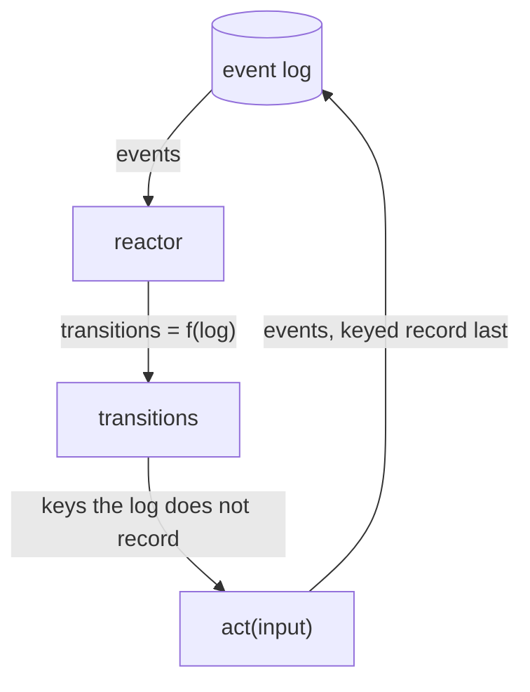
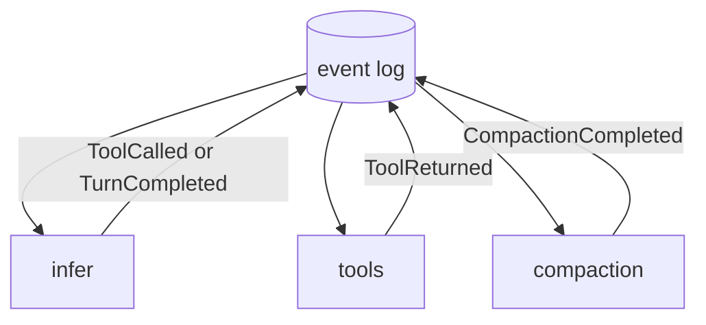

# flamework

flamework is a library for durable agents: the event log is the only state, reactors derive work from it, and a reconciler fires what the log does not yet record.

## Events

Events are things that you care about. An event is a fact, recorded once and never edited. Everything else is derived from the set of them.

```ts
// Event is the open record every log stores. Concrete events narrow the shape.
type Event = { type: string } & Record<string, unknown>

type MessageReceived = { type: "MessageReceived"; id: string; text: string; at: number }
type ToolCalled = { type: "ToolCalled"; callId: string; name: string; arguments: unknown }
type ToolReturned = { type: "ToolReturned"; callId: string; result: unknown }
type TurnCompleted = { type: "TurnCompleted"; output: string }
```

## Projections

A projection is that derivation, named: a pure function from the event set to a value.

```ts
type Projection<T> = (events: ReadonlyArray<Event>) => T

// done: the turn has reached its terminal.
const done: Projection<boolean> = (events) => events.some((e) => e.type === "TurnCompleted")
```

There is no cache and no invalidation: the log is the source, so a projection can never be stale. This is `state = f(log)`, the way React's derived values are `f(state)`. If a piece of logic appends nothing, it is a projection, never a reactor; reactors exist only for work that must land in the log.

## Transitions and reactors

If you know React's `UI = f(state)`, you know the shape here: `transitions = f(log)`.

```ts
// Transition is one keyed unit of work: state in, events out. key and input are
// projections of the event set, so a retried fire is the same work, absorbed by
// its key (packages/core/tla/Reconcile.tla, CommitOne). act may be nondeterministic.
interface Transition<T> {
  readonly key: string
  readonly input: T
  readonly act: (input: T) => Effect.Effect<ReadonlyArray<Event>, never, EventLog | R>
}

// Reactor derives the transitions the log enables. It must ignore event order
// (packages/core/tla/Projection.tla, ViewFaithful). The runtime fires each key the
// log does not record and appends the results, keyed record last.
type Reactor = (events: ReadonlyArray<Event>) => ReadonlyArray<Transition>
```

An actor is a set of reactors over one log, plus the key derivation that decides commitment.



## Example: an agent

An agent is three reactors over one log. Start with a projection: which calls have no result yet? An absence is state too, and only a function over the whole set can see one.

```ts
const unansweredCalls: Projection<ReadonlyArray<ToolCalled>> = (events) =>
  events
    .filter((e) => e.type === "ToolCalled")
    .filter((c) => !events.some((e) => e.type === "ToolReturned" && e.callId === c.callId))

// tools: one transition per unanswered call.
const tools: Reactor = (events) =>
  unansweredCalls(events).map((call) =>
    transition({
      key: call.callId,
      input: call,
      act: (call) => Effect.promise(async () => [{ type: "ToolReturned", callId: call.callId, result: await toolbox[call.name](call.arguments) }])
    })
  )

// infer: an inference is enabled when every call is answered and no terminal yet.
// The key is the count of answered calls: a crashed inference never records llm/2,
// so the next settle derives llm/2 again and retries. Durability, with no retry code.
const infer: Reactor = (events) => {
  if (done(events) || unansweredCalls(events).length > 0) return []
  const attempt = events.filter((e) => e.type === "ToolReturned").length
  return [transition({ key: `llm/${attempt}`, input: events, act: runLlm })]
}

const agent: Actor = { reactors: [infer, tools, compaction], keyOf }
```

Every reactor on this page has the same anatomy: a projection derives the input, the reactor keys it, the act does the work. Adding a capability is adding a reactor to the list.



`packages/agent` ships this agent grown up: inference with died-attempt marks and a give-up guard, tool dispatch through durable code execution, budgets, replies, and compaction, each one a reactor.

## The front door

`createAgent` hosts that agent over an in-process runtime: bring packages and a mind, ask a brief, get the settled answer.

```ts
import { createAgent } from "@flamecast/agent/main"

const mind = createAgent({
  packages: [invoices], // methods the agent's generated code calls, e.g. invoices.lookup({orderId})
  infer: async (trajectory) => nextAction(trajectory), // one inference over the trajectory, one action out; platform/model binds a real provider
  log: persisted // an agent initialises from a log, because the log is the only state there is
})

const reply = await mind.ask("Find the invoice for order 4182.")
```

## Durability

`packages/host` is the reference in-memory binding. `platform/bun` is the same semantics with physics: the log lives in SQLite through @effect/sql, and `recover()` re-derives owed work from a surviving log after a process death. Kill the process mid-turn and start again: a transition that committed absorbs, and one that never recorded its key fires again.

## Layout

| Directory | Holds |
| --- | --- |
| `packages/core` | The contracts: Event, EventLog and its six guarantees, KeyFragment, Transition, Reactor, the reconciler, Router |
| `packages/code` | Durable code execution: recorded package calls, parks as BlockedOn evidence, replay drift guard, the contract gate |
| `packages/agent` | The agent as reactors: inference, tools, budget, reply, compaction, the Infer port, and createAgent |
| `packages/host` | The reference in-memory binding: the executable statement every platform must match |
| `platform/model` | The Infer binding over TanStack AI: Bedrock Converse and OpenAI-compatible wires |
| `platform/bun` | The durable host binding: SQLite through @effect/sql, with recovery from a surviving log |

The line between the trees is a dependency rule: a package depends on effect and on other packages, and on nothing else. A platform binds one port to the world and owns its own dependencies. `platform/README.md` states the rule in full.

## Guarantees

A store that binds the log port owes six guarantees, stated in `packages/core/src/event-log.ts`: append only, total order per log, one writer, atomic batches, dedup by key, and the ordered tail from a watermark. The reconciler's properties are model checked in `packages/core/tla` (Reconcile, Projection, Replay, Driver, Delivery). Every delivered cross-lane event names its occurrence through a key fragment, and both hosts refuse an unkeyed traveler.

## Status

The packages are private workspace packages, consumed in-repo. The docs/ tree predates this design and describes the removed harness and codemode surfaces; it is queued for a rewrite. `platform/model` carries the proven driver; journaled backoff, model-reported limits, provider continuations, and spend reservation are the next behaviors to land on it.

## Contributing

Read [CONTRIBUTING.md](CONTRIBUTING.md) and run `bun run gate` before finishing a change.
