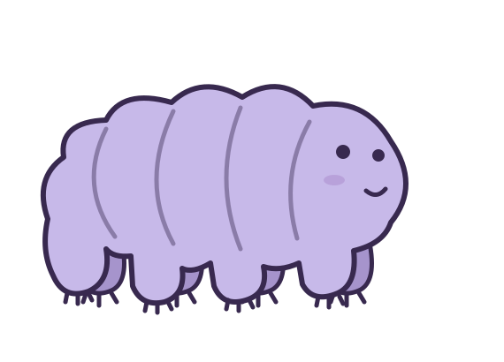
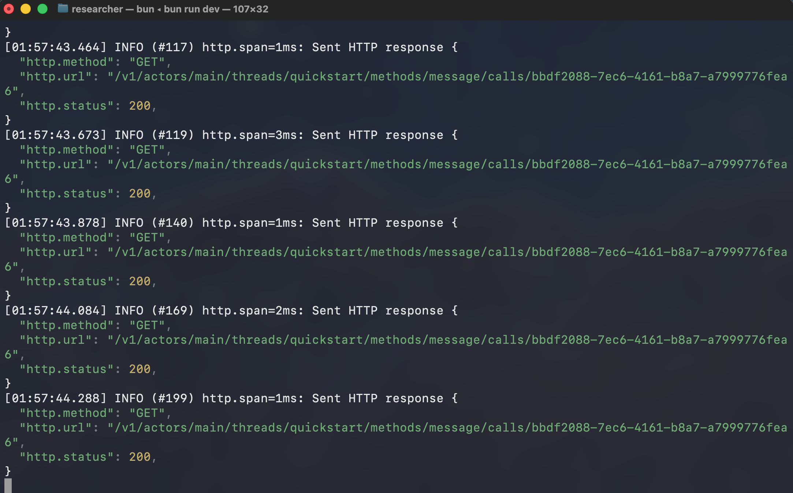

<p align="center">
  <br>
  
</p>

<p align="center">
  <a href="https://www.npmjs.com/package/tardie"></a>
  <a href="https://discord.gg/Z74jwRxz4k"></a>
</p>

> [!WARNING]
> We're actively working on finding the right abstractions and ergonomics. Expect breaking changes until a stable release.

# Tardigrade

Tardigrade is a typescript framework for building modular agents around an immutable event log. It is built on [Effect TS](https://effect.website/) and is inspired by [React](https://react.dev/)'s declarative approach to building user interfaces.

### A declarative way to author behavior
Building an agent can be challenging, especially as they operate over longer horizons. Tasks get harder, behaviors become harder to reason about, and the harnesses we build around our agents get ever more complex.

Tardigrade presents a way to simplify this complexity by proposing a new way of thinking about agent harnesses. We took inspiration from React.

React derives its component tree and declared effects from state. Tardigrade applies the same idea to agent harnesses. An agent is a set of components tree over an immutable event log, and each component derives a view and enabled transitions as a pure function of the event log.

<p align="center"><code>{ view, transitions } = f(event log)</code></p>

## Why Tardigrade

- **Composable harness.** Add tools, code execution, budgets, compaction, and replies as independent components.
- **Strongly typed, built on Effect.** Typed services and Layers make each component's dependencies explicit. A missing service fails during compile.
- **Crash proof.** A durable host derives unfinished work from the stored log.
- **Serverless.** All you need is a durable store, no process has to stay alive. Any new invocation reads the log, runs the transitions it owes, and settles.
- **Inspect and improve every run.** Log as core supports native debugging, replay, and experiments with state forked from any checkpoint. Copy a thread's rows onto a new root with `tdg thread fork` or `host.forkThread`.

## Quickstart

Install Tardigrade and initialize an editable template actor. Use Bun 1.4 or later. If you are using a coding agent, the [Tardigrade skill](skills/tardigrade/SKILL.md) can help.

If you have an existing agent application, follow the [migration guide](docs/how-to/migrate.md) to move its harness, history, API, client, and deployment configuration.

```bash
bun add -g tardie@latest
tdg init tardie-agent --template quickstart
cd tardie-agent
bun run dev
```

`tdg init` configures the first provider and model. Edit `actor.ts` to describe the agent. The [CLI guide](docs/references/cli.mdx) covers non-interactive setup, more providers, and deployment.

The generated actor uses a sample weather tool. To build a research agent, use the live paper search tool in the composition below.

From another shell, discover the actor's methods, allocate a root thread, and send it a message:

```bash
tdg methods
tdg thread create --name quickstart
tdg call message '{"text":"What is the weather in Singapore?"}' --thread quickstart
```

The API listens at [localhost:4242](http://localhost:4242) by default. View the interactive API reference at [localhost:4242/docs](http://localhost:4242/docs).



## Examples

- [Quickstart](examples/quickstart/actor.ts): a small actor with one typed tool.
- [RLM](examples/rlm/actor.ts): code execution, fetching, and subagents.
- [React RLM chat](examples/react-rlm-chat/README.md): a deployable RLM server and React chat.

## Deploy

Deploy the generated Worker with either platform CLI:

Cloudflare:

```bash
bunx wrangler deploy
```

Celld:

```bash
celld deploy --config celld.jsonc
```

See the [Cloudflare](platform/cloudflare/README.md) and [Celld](docs/platforms/celld.mdx) guides for platform configuration and secrets.

## Build your own harness

```bash
bun add tardie
```

You can use `npm install tardie` instead. Install `tardie@next` to test a release candidate.

### Create a component

The [`ComponentDefinition` interface](packages/core/src/component/machine.ts#L40) defines `initial`, `step`, and `output`. `tool` is a helper that creates a component from a tool specification and an Effect handler:

```ts
import { Effect } from "effect"
import { tool } from "tardie/agent"

const papers = tool({
  spec: {
    name: "search_papers",
    description: "Search OpenAlex for paper titles, years, and links",
    inputSchema: {
      type: "object",
      properties: { query: { type: "string" }, limit: { type: "integer", minimum: 1, maximum: 5 } },
      required: ["query", "limit"],
      additionalProperties: false
    }
  },
  run: (input) => Effect.promise(async () => {
    const { query, limit } = input as { query: string; limit: number }
    try {
      const response = await globalThis.fetch(`https://api.openalex.org/works?search=${encodeURIComponent(query)}&per_page=${limit}&select=id,display_name,publication_year`)
      if (!response.ok) return { error: `OpenAlex returned ${response.status}` }
      const data = await response.json() as { results: unknown[] }
      return data.results
    } catch (error) {
      return { error: String(error) }
    }
  })
})
```

An offered tool follows this lifecycle:

1. The component adds `search_papers` to the agent's composed view.
2. `infer` includes its specification in the model request.
3. The model calls it. Tardigrade records `ToolCalled`.
4. Tardigrade runs the attached handler and records `ToolReturned`.
5. `infer` includes the result in the next model request.

### Compose an agent

Mount the component beside the built-in parts that this task needs:

```ts
import { actor } from "tardie/core"
import { agentMethods, agents, budget, compact, messages, infer, outputValidateOnce, system, tools } from "tardie/agent"
import { fetch, workspace } from "tardie/code"

const researcher = actor({
  name: "researcher",
  methods: agentMethods,
  components: [infer([
    system("You are a research assistant. Investigate the question and cite your sources."),
    papers,
    compact(messages(), { triggerRatio: 0.8, retainRatio: 0.5 }),
    budget(tools([ // or codeMode([...])
      fetch(),
      agents(),
      workspace()
    ]), {
      limit: 12,
      usage: ({ calls }) => calls.length,
      onExhausted: (reason, settle) => settle({ error: reason })
    }),
    outputValidateOnce
  ])]
})
```

- `actor` names the agent and exposes its methods. `infer` runs its components with the host's model policy.

- `compact(messages())` summarizes at the chosen `triggerRatio` and keeps the chosen `retainRatio` of recent context.

- `budget(...)` counts tool calls in its subtree and runs `onExhausted` when the limit is reached.

This agent can search papers, fetch sources, delegate research, and store notes. Change the package list to create another harness.

A run can follow this path:

```text
MessageReceived -> search_papers -> fetch_get -> TurnCompleted
```

Each action and result becomes an event that every component can interpret.

### Run the composition

<details>
<summary>Bind a model and durable SQLite host</summary>

The three code blocks form one program. Run it in a project configured by `tdg init` or `tdg setup`, with the provider credentials available in the environment. The model services select the provider implementation from the configured protocol.

```ts
import { createBunHost } from "tardie/bun"
import { bunModelServices } from "tardie/server/model-services"

const { layers } = await bunModelServices({
  env: process.env
})

const host = await createBunHost({
  actor: researcher,
  storage: ".tardigrade",
  layersFor: () => layers
})

try {
  const thread = await host.allocateRootThread({ instance: "researcher", name: "main" })
  const result = await thread.methods.message(
    { text: "Research durable agent architectures and compare their tradeoffs. Cite sources." },
    { key: "architecture-research" }
  )
  console.log(result)
} finally {
  await host.close()
}
```

`bunModelServices` reads the model policy from `wrangler.jsonc` and binds inference and platform services. `createBunHost` stores actor instances under `storage`. The method call returns the completed result; retries with the same key return the same invocation. Use a new key for each new request.

</details>

## How durability works

Every message, model action, tool result, and checkpoint lands in the log. Component machines consume those events and derive keyed transitions from their current state.

<p align="center"><code>Sₙ₊₁ = step(Sₙ, eₙ₊₁)</code></p>

The host runs transitions with unrecorded keys. It appends their events and repeats until the agent rests.

If the process stops during `search_papers`, the log still contains its unanswered `ToolCalled`. `host.recover()` replays the log through the component machines, derives the same key and input, then runs the handler again. Live execution only steps the machines with newly appended events.

External effects have at-least-once execution. Each keyed result is recorded once. Providers can use the transition key as an idempotency key.

## Learn more

- [Quickstart](docs/getting-started/quickstart.mdx): build and deploy a Tardigrade actor.
- [HTTP server](docs/how-to/server.md)
- [CLI](docs/references/cli.mdx)
- [Why Tardigrade](docs/start-here/Why.mdx): learn what the log-as-state model makes possible.

## Contributing

Read [CONTRIBUTING.md](CONTRIBUTING.md) and run `bun run gate` before finishing a change.
