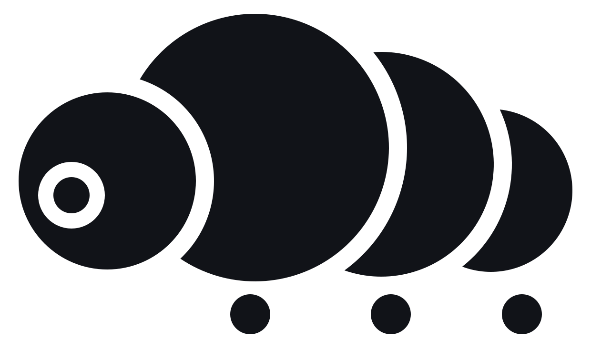

<p align="center">
  <br>
  <picture>
    <source media="(prefers-color-scheme: dark)" srcset="docs/assets/logo-dark.svg">
    
  </picture>
</p>

# Tardigrade

### A harness made for self-improvement

Building and running an agent in production is tough. Whenever an agent misbehaves, we often handcraft a new eval case and hope it doesn't happen again.

As models get increasingly smart, they will be capable of doing these improvements themselves. To fully utilise this and create a cycle of self-improvement, we need a harness that can be inspected, forked, and varied. Observability and the ergonomics around it should be native to the harness.

Tardigrade is that harness. An agent can take any production run that went wrong, fork it, customize any part of the harness, and replay thousands of variations before your users hit the next one.

### Log is all you need

How can a harness be fully customizable, yet remain reliable in production? We took inspiration from React. Designing a harness is like designing a user interface, except the user is a language model.

React solved this for the DOM by declaring the component tree as a function of state: `UI = f(state)` and the set of valid state transitions as `{transitions} = f(state)`. The simplicity of React enabled expressiveness in authoring applications without sacrificing reliability. A harness needs the same shape, but with the log as state.

$$\lbrace\mathrm{transitions}\rbrace = f(\mathrm{log})$$

## Quickstart

Build an RLM agent by combining capabilities.

```ts
import { agentOf, budget, codeMode, compaction, reply } from "@tardigrade/agent"
import { infer } from "@tardigrade/model/model"
import { createBunHost } from "@tardigrade/bun/host"
import { fileTelemetry } from "@tardigrade/bun/file"

// A capability provides the model its context and services the calls that come back.
// Mounting one is adding it to the list; `toolList([...])` mounts a fixed tool list instead.
const agent = agentOf([codeMode, reply, budget, compaction])

// createBunHost runs the actor over a durable SQLite log; layersFor wires the model binding.
const host = await createBunHost({
  log: "agents.sqlite",
  actorFor: () => agent,
  layersFor: () => infer({ baseUrl: process.env.MODEL_BASE_URL!, apiKey: process.env.MODEL_API_KEY!, model: process.env.MODEL_ID!, provider: "bedrock" }),
  telemetry: fileTelemetry("spans.ndjson")
})
await host.deliver("bun:main", { type: "MessageReceived", id: "m1", text: "What changed in the deploy?", at: Date.now() })
await host.drive()
```

The run leaves its spans in `spans.ndjson`. The ClickHouse binary (`brew install clickhouse`) queries the file in place, no server:

```bash
clickhouse local -q "
  SELECT SpanName, SpanAttributes['outcome'] AS outcome, Duration / 1e6 AS ms
  FROM file('spans.ndjson', JSONEachRow,
    'Timestamp String, SpanName String, Duration UInt64, SpanAttributes Map(String, String)')
  ORDER BY Timestamp"
```

## Concepts

### Events

An event is the smallest primitive. It's an immutable fact, recorded once in the event log. You define events based on what's meaningful in your domain. For example, when building an agent, your events could be `MessageReceived`, `ToolCalled` etc.

```ts
// An Event is an open record. Concrete events narrow it.
type Event = { type: string } & Record<string, unknown>

type MessageReceived = { type: "MessageReceived"; id: string; text: string; at: number }
type ToolCalled = { type: "ToolCalled"; callId: string; name: string; arguments: unknown }
type ToolReturned = { type: "ToolReturned"; callId: string; result: unknown }
type TurnCompleted = { type: "TurnCompleted"; output: string }
```

### Projections

A projection is a pure function that takes an event log and returns a value. Projections help to slice an event log into different views based on the consumer.

```ts
type Projection<T> = (events: ReadonlyArray<Event>) => T

// done: the turn has reached its terminal.
const done: Projection<boolean> = (events) => events.some((e) => e.type === "TurnCompleted")
```

### Transitions and reactors

A transition is a keyed unit of state change. It takes in state, and returns new events. Reactors compute the transitions enabled by a given event log.

```ts
// state in, events out. A retried fire is the same work, absorbed by its key.
interface Transition<T> {
  readonly key: string
  readonly input: T
  readonly act: (input: T) => Effect.Effect<ReadonlyArray<Event>, never, EventLog | R>
}

// Derives the transitions the log enables. The runtime fires each key the log does not record.
type Reactor = (events: ReadonlyArray<Event>) => ReadonlyArray<Transition>
```

An actor is a set of reactors over one log, plus the key derivation that decides commitment.

### Capabilities

A capability is one component of an agent: it provides the model its context and services the calls that come back, as one value. What the model is shown is a projection of the log, like everything else; the handlers are reactors. `agentOf` mounts a list of capabilities into an actor and injects the model loop, so adding a capability is one edit.

```ts
// One value: the render into the model's request, and the handlers for what comes back.
interface Capability {
  readonly name: string
  readonly keys?: KeyFragment                          // its alphabet fragment
  readonly reactors?: ReadonlyArray<Reactor>           // how its work settles
  readonly tools?: (events: Event[]) => ToolSpec[]     // what the model is offered, derived from the log
  readonly system?: string                             // the fragment explaining them
  readonly serve?: Serve                               // how one call becomes events
}
```

## Docs

- [Quickstart](docs/quickstart.md): the concepts in one page: events, projections, transitions, reactors, an agent in three reactors.
- [Tutorial: an RLM agent](docs/tutorials/rlm-agent.md): a Recursive Language Model agent with durable code execution, killed mid-recursion.
- [How-to: gate tools](docs/how-to/gate-tools.md): hide, reveal, or revoke tools from the log.
- [How-to: observe](docs/how-to/observe.md): wire a tracer, traces in ClickHouse, the one-trace contract, the outcome vocabulary.
- [Reference: API](docs/reference/api.md): Event, Projection, Transition, Reactor, Actor, send, settle, resting.
- [Why tardigrade](docs/explanations/why.md): state = f(log), the convergence of durable systems, agents as the new users.
- [Reactors](docs/explanations/reactors.md): the reactor model, with the React analogy and the math.
- [Actors](docs/explanations/actors.md): one log, its reactors, and the settle loop.

## Layout

```
packages/
  core/      contracts: Event, EventLog, KeyFragment, Transition, Reactor, Router
  code/      durable code execution
  agent/     capabilities, the runtime (`agentOf`), and the RLM default (`createRlmAgent`)
  host/      the reference in-memory binding
platform/
  model/     the Infer binding over TanStack AI
   bun/       the durable host binding: SQLite through @effect/sql-sqlite-bun
```

## Contributing

Read [CONTRIBUTING.md](CONTRIBUTING.md) and run `bun run gate` before finishing a change.
