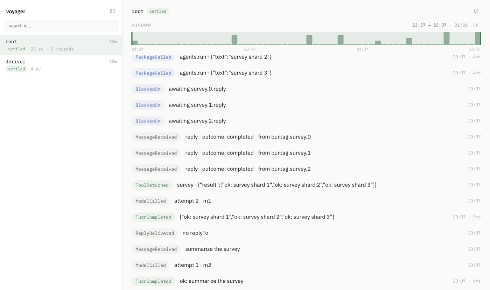

<p align="center">
  <br>
  <picture>
    <source media="(prefers-color-scheme: dark)" srcset="docs/assets/logo-dark.svg">
    
  </picture>
</p>

<p align="center">
  <a href="https://www.npmjs.com/package/tardie"></a>
  <a href="https://discord.gg/Z74jwRxz4k"></a>
</p>

# Tardigrade

Tardigrade is a typescript framework for building durable, modular agents that can run at the edge. It is inspired by [React](https://react.dev/)'s declarative approach to building user interfaces.

### Agents that can self-improve
As models get increasingly smart, they will be capable of writing their own harnesses to improve themselves ([Meta-Harness](https://arxiv.org/abs/2603.28052)). A harness that is too rigid and complex is a bottleneck to this. We need something more composable, and easy to author.

We took inspiration from React. React derives its component tree and declared effects from state (`{ UI, effects } = f(state)`). Tardigrade derives a view and state transitions from the event log, an idea with roots in [Harel's statecharts](https://www.sciencedirect.com/science/article/pii/0167642387900359).

$$\lbrace\mathrm{view},\ \mathrm{transitions}\rbrace = f(\mathrm{log})$$

## Why Tardigrade

- **Composable harness.** Add tools, code execution, budgets, compaction, and replies as independent components.
- **Strongly typed, built on Effect.** Typed services and Layers make each component's dependencies explicit. A missing service fails during compile.
- **Crash proof.** A durable host derives unfinished work from the stored log.
- **Serverless.** All you need is a durable store, no process has to stay alive. Any new invocation reads the log, runs the transitions it owes, and settles.
- **Inspect and improve every run.** Log as core supports native debugging, replay, and experiments with state forked from any checkpoint.

## Quickstart

Install Tardigrade and initialize an editable template actor. Use Bun 1.4 or later. If you are using a coding agent, the [Tardigrade skill](skills/tardigrade/SKILL.md) can help.

If you have an existing agent application, follow the [migration guide](docs/how-to/migrate.md) to move its harness, history, API, client, and deployment configuration.

```bash
bun add -g tardie
tdg init researcher
cd researcher
```

The `init` command creates `researcher/actor.ts` from the bundled template. The template exports a named actor with `agentMethods`, the typed interface for sending a message and reading its state from the log. Read the [Quickstart guide](docs/quickstart.md) to understand the framework, then edit `actor.ts` to describe the agent. Push builds the actor and writes it to the local actor registry:

```bash
tdg setup
tdg push actor.ts --target local
tdg dev
```

In a non-interactive terminal, state every setup value and inject the credential through the environment variable named by `--credential-env`:

```bash
tdg setup \
  --provider openai \
  --base-url https://api.openai.com/v1 \
  --driver openai-responses \
  --credential-env OPENAI_API_KEY \
  --default-model gpt-5.2
```

Keep `tdg dev` running. Discover the actor's methods, then call `message` from another shell in the same directory:

```bash
tdg methods --actor researcher
tdg call message '{"text":"read this repo and tell me what it does"}' --actor researcher
```

Voyager opens at [localhost:4242](http://localhost:4242) by default. `tdg call` prints the direct Voyager URL for the new trace.

<picture>
  <source media="(prefers-color-scheme: dark)" srcset="docs/assets/voyager-dark.png">
  
</picture>

## Build your own harness

```bash
bun add tardie
```

You can use `npm install tardie` instead. Install `tardie@next` to test a release candidate.

### Create a component

An agent is made of components. A component derives a view and owed transitions from the log. An agent view includes system fragments, tool bindings, and context policy. This component gives the model one tool and owes no autonomous work:

```ts
import type { AgentComponent } from "tardie"

const deploys: AgentComponent = {
  name: "deploys",
  derive: () => ({
    view: {
      system: ["Inspect recent deployments when a release may explain an incident."],
      tools: [{
        spec: {
          name: "recent_deploys",
          description: "List recent production deploys",
          inputSchema: { type: "object", properties: {}, additionalProperties: false }
        },
        serve: (_call, _log, answer) => [
          answer([{ service: "api", revision: "a17c", summary: "Add rate limiting" }])
        ]
      }],
      context: [],
      output: []
    },
    transitions: []
  })
}
```

`derive` is a pure log projection. Each tool binding keeps its specification and handler together, so a tool derived for the model is routable by construction. `answer` mints the transition that records the result. Replace the sample result with a call to your deployment API.

The call follows one route:

1. The component adds `recent_deploys` to its derived view.
2. The model selects it and returns a tool call. Tardigrade records `ToolCalled` in the log.
3. The infer root finds the paired handler in the view that offered the call and asks it to serve against the current log.
4. Tardigrade records `ToolReturned`. The next model request includes the result.

### Compose an agent

Mount the component beside the built-in parts that this task needs:

```ts
import {
  actor, agentMethods, agentsPackage, budget, codeMode,
  compaction, defineActor, fetchPackage, filesPackage, infer,
  outputValidateOnce, reply, system, workspacePackage
} from "tardie"

const instructions = system(
  "You are a release analyst. Identify risky changes and recommend the safest next action."
)

const releaseModel = { provider: "openai", default_model: "gpt-5.2" } as const

const releaseAnalyst = defineActor({
  name: "release-analyst",
  methods: agentMethods,
  actor: actor(infer([
    instructions, // the agent's system prompt
    deploys,     // recent_deploys and its paired handler
    codeMode([
      filesPackage(),
      fetchPackage(),
      agentsPackage(),
      workspacePackage()
    ]),
    budget,      // a per-turn code budget
    compaction(), // bounded model context
    reply,       // results for parent agents
    outputValidateOnce // validates one structured result without correction
  ], releaseModel))
})
```

`infer` composes the components into an agent loop. Its trailing options select a private provider connection and the default model used through it. `defineActor` gives that loop a stable name and callable interface. `agentMethods` provides a `message` method with `{ text, input?, model? }` input and a string result. `model` is a model ID for that turn; it cannot change the actor's provider connection.

`compaction(policy?)` bounds model context. The host resolves the selected model's window from its catalog snapshot. Compaction fires at 80 percent and keeps a 50 percent tail unless the actor states other ratios:

```ts
const boundedContext = compaction({
  fireRatio: 0.8,
  keepRatio: 0.5
})
```

When compaction runs, its checkpoint records the applied policy with the summary.

`codeMode([...components])` combines code packages behind one `execute` tool. Define a package with `definePackage(...)`. Group packages with `composeComponents(...)`.

This agent can inspect deployments and files, fetch sources, delegate research, and analyze results with JavaScript. Change the package list to create another harness.

A run can follow this path:

```text
MessageReceived -> recent_deploys -> execute -> TurnCompleted
```

Each action and result becomes an event that every component can interpret.

### Run the composition

<details>
<summary>Bind a model and durable SQLite host</summary>

The three code blocks form one program.

```ts
import { Layer } from "effect"
import { BunFileSystem, BunPath } from "@effect/platform-bun"
import { FetchHttpClient } from "effect/unstable/http"
import { infer } from "tardie/model"
import { createBunHost } from "tardie/bun/host"

const model = infer({
  baseUrl: "https://api.openai.com/v1",
  apiKey: process.env.OPENAI_API_KEY!,
  provider: releaseModel.provider,
  model: releaseModel.default_model,
  driver: "openai-responses",
  contextWindowTokens: 400_000
})

const platform = Layer.mergeAll(
  model,
  BunFileSystem.layer,
  BunPath.layer,
  FetchHttpClient.layer
)

const host = await createBunHost({
  log: "agents.sqlite",
  actorFor: () => releaseAnalyst.actor,
  layersFor: () => platform
})

await host.commitRoot("bun:main", {
  type: "MessageReceived",
  id: "m1",
  text: "What changed in the deploy?",
  at: Date.now()
})
await host.drive()

const completed = (await host.read("main")).findLast(
  (event) => event.type === "TurnCompleted"
)
console.log(completed)
await host.close()
```

The actor provider and default model must match the binding. The binding states its protocol and context window, so selection is checked before a request spends tokens.

</details>

## How durability works

Every message, model action, tool result, and checkpoint lands in the log. Reactors read that log and derive keyed transitions.

$$\lbrace\mathrm{transitions}\rbrace = f(\mathrm{log})$$

The host runs transitions with unrecorded keys. It appends the returned events and repeats until the agent rests.

If the process stops during `recent_deploys`, the log still contains its unanswered `ToolCalled`. `host.recover()` derives the same key and input, then runs the handler again.

Effects have at-least-once execution. Each keyed result is recorded once. Providers can use the transition key as an idempotency key.

## Learn more

- [Quickstart](docs/quickstart.md): build the event loop and its agent components from first principles.
- [HTTP server](docs/how-to/server.md)
- [CLI](docs/how-to/cli.md)
- [Why Tardigrade](docs/explanations/why.md): learn what the log-as-state model makes possible.

## Contributing

Read [CONTRIBUTING.md](CONTRIBUTING.md) and run `bun run gate` before finishing a change.
