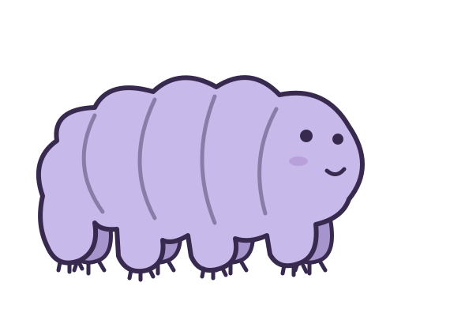

<p align="left">
  <br>
  
</p>

<p align="left">
  <a href="https://www.npmjs.com/package/tardie"></a>
  <a href="https://discord.gg/Z74jwRxz4k"></a>
</p>

> [!WARNING]
> Tardigrade is under active development. APIs may change.

# Tardigrade

Tardigrade is a typescript framework for building composable agents around an immutable event log. It is built on [Effect TS](https://effect.website/) and takes a functional approach to managing agent state and effects, drawing inspiration from [Elm](https://elm-lang.org/), and [Jotai](https://jotai.org/).

<p align="center"><picture><source media="(prefers-color-scheme: dark)" srcset="assets/event-log-equation-dark.svg"></picture></p>

## Quickstart

If you use the legacy component API, see the [migration guide](docs/migration/state-initialisation.mdx) for moving existing state to atoms.

```sh
bunx tardie init meeseeks --template quickstart
```

For coding agents, use the [Tardigrade skill](https://github.com/clavia-labs/tardigrade/blob/main/skills/tardigrade/SKILL.md).

### Atoms hold state

```sh
bun add tardie
```

Use atoms to store values for other atoms to use.

```ts
import { atom } from "tardie/core"

const role = atom("You are a research assistant.")
const style = atom("Cite your sources and keep answers concise.")
```

Derive values from atoms using `get`.

```ts
const system = atom(get => `${get(role)}\n${get(style)}`)
```

### Durable atoms reduce state from event log

Durable atoms reduce an immutable event log into state.

```ts
import { Schema } from "effect"
import { durableAtom } from "tardie/core"
import { Event, TrajectoryState, trajectoryState } from "tardie/agent"

const history = durableAtom({
  name: "researcher.history",
  input: Event,
  schema: TrajectoryState,
  initial: { entries: [], models: [] },
  reduce: trajectoryState,
})

const messages = atom(get => get(history).entries.map(entry => entry.message))
```

### Effect atoms propose actions

Effect atoms derive views and propose actions.

Simplified [`compact`](packages/agent/src/atoms/compact.ts):

```ts
const compact = messages => effectAtom(get => {
  const history = get(messages)
  const state = get(compactionState)
  const context = prepareMessages(history, state)
  const shouldSummarize = !state.pending && exceedsThreshold(context)

  return {
    view: { messages: context, compacting: Boolean(state.pending) },
    events: {},
    acts: shouldSummarize ? { summarize: summarizeRequest(context, state) } : {},
  }
})
```

Recorded results update durable compaction state.

### It's atoms all the way

Compose the atoms into an agent actor.

```ts
import { Effect } from "effect"
import { atom, defineActor } from "tardie/core"
import { workspace, fetch } from "tardie/libraries"
import { agentMethods, codeMode, compact, infer, messages } from "tardie/agent"

const researcher = defineActor("researcher", Effect.gen(function* () {
  const tools = yield* codeMode([workspace(), fetch()])
  const context = yield* compact(messages, {
    triggerRatio: 0.8,
    retainRatio: 0.5,
  })
  const agent = yield* infer(atom(get => ({
    system: get(system),
    tools: get(tools),
    context: get(context),
  })))

  return { atom: agent, methods: agentMethods }
}))
```

```text
event log -> history -> messages -> compact --+
                                              |
                                    system ---+-> infer -> researcher
                                              |
                                     tools ---+
```

## Hosting

Host each actor instance with an ActorDO for its supervisor directory and a separate SQLite-backed ThreadDO for each thread on Cloudflare or a self-hosted [Celld fleet](https://github.com/denoland/celld/blob/main/docs/README.md). The same Worker entrypoint runs on both.

```ts
import { actorContext } from "tardie/agent"
import { createActorWorker } from "tardie/platform/cloudflare"
import { researcher } from "./actor"
import { services } from "./services"

const worker = createActorWorker({
  actor: researcher,
  actorContext,
  services: () => services(),
})
export const ActorDO = worker.ActorObject
export const ThreadDO = worker.ThreadObject
export default worker
```

`createActorWorker` routes requests and provides the ActorDO and ThreadDO classes.

ActorDO allocates and routes to threads; each ThreadDO owns a separate database with its state and journal. Each thread records its parent, through which we derive the logical lineage, here A -> B -> C.

```text
ActorWorker -> ActorDO [supervisor DB]
               └── directory
                   ├── A [ThreadDO, thread DB]
                   ├── B [ThreadDO, thread DB, parent: A]
                   └── C [ThreadDO, thread DB, parent: B]
```

The [Quickstart](docs/getting-started/quickstart.mdx) generates services and deployment configs with both DO bindings. Configure your model and credentials, then run or deploy.

Run locally with `bunx wrangler dev`; see [local setup](docs/platforms/cloudflare.mdx#verify-locally).

[Cloudflare](https://developers.cloudflare.com/workers/wrangler/commands/#deploy):

```sh
bunx wrangler deploy
```

Or deploy to a Celld fleet, using its storage bucket:

```sh
celld deploy --config celld.jsonc --bucket s3://actors
```

See the [Cloudflare](docs/platforms/cloudflare.mdx) and [Celld](docs/platforms/celld.mdx) guides for configuration and credentials. For a Bun process, see the [Bun example](packages/examples/bun.ts) and [service wiring](packages/examples/services.ts).

## Contributing

See [CONTRIBUTING.md](CONTRIBUTING.md).
