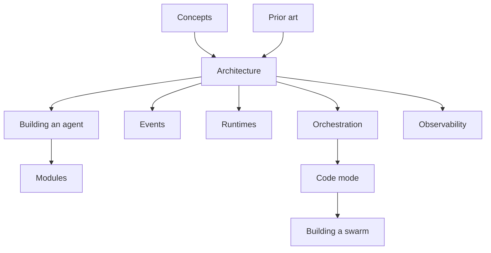

# Documentation

flamecast-core separates deterministic agent structure from platform bindings and model transport.

## Reading Path

1. [Concepts](concepts.md) defines the vocabulary.
2. [Architecture](architecture.md) shows compilation, turn execution, and orchestration.
3. [Building an agent](building-an-agent.md) walks through the public SDK.
4. [Modules](modules.md) documents composition and the built-in module catalog.
5. [Events](events.md) owns the event alphabet and dedup rules.
6. [Runtimes](runtimes.md) owns the platform port contract and binding status.
7. [Orchestration](orchestration.md) covers delegation, serving agents at addresses, and swarm inspection.
8. [Code mode](codemode.md) covers capabilities, the sandbox port, and scripts that delegate.
9. [Building a swarm](building-a-swarm.md) walks through multiple agents, spawning, and model-written fan-out.
10. [Observability](observability.md) covers reading, rendering, replaying, and forking logs.
11. [Prior art](prior-art.md) records the external systems and research that informed the design.

The repository [README](../README.md) is the package-level entry point.
