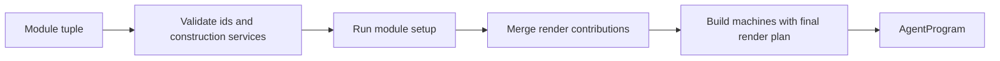
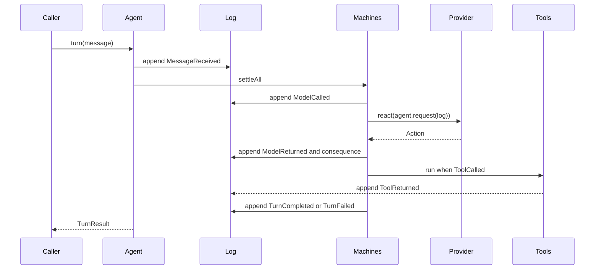

# Architecture

## Compile Modules Into a Program



Compilation has two jobs. It rejects invalid composition, then it produces the program that serves every turn.

The validation order matters. All construction services are collected before any module runs `setup`, so module order does not restrict dependency injection. Render contributions are merged before machine builders run, so a machine closes over the same render plan that `agent.request(log)` exposes.

## Serve a Turn



The runtime holds the session writer lock around a turn or replay. Every machine folds the same log and tolerates events owned by other modules. Quiescence is a full pass that appends nothing.

## Static Prefix and Dynamic Tail

The render plan separates static instructions from conditional nudges.

```text
system prefix: module instructions + explicit system nudges
messages: compacted conversation + active tail nudges
tools: provider-native tools adjusted by active nudges
```

This shape keeps common request prefixes stable across turns. Dynamic budget, contract, citation, and workflow reminders stay near the tail unless a module explicitly requests system placement.

## Typed Construction Services

Effect service keys form the module dependency graph. A producer contributes a typed `Context`. A consumer declares service keys and receives a context containing only those dependencies.

The compaction module demonstrates the pattern. Inference provides a pure projection of the selected model and context window. Compaction reads that projection with `Context.get` and computes its thresholds from the current window. A model switch changes thresholds without a global registry or hidden module state.

Pure construction services use Effect `Context` directly. Effectful capabilities use Effect requirements and Layers. Modules separately declare the projections used for observational comparison, so generic service values do not become an accidental serialization format.

## Multi-Agent Orchestration

The framework exposes routing primitives and leaves topology in user code or model behavior.

- `Router.call(address, event)` performs a synchronous sub-call and returns the terminal event. `Router.deliver(address, event)` sends asynchronous work.
- `callAgent(address, message)` is delegation as an awaitable value, and `subagentTool()` is the same call as a provider-native tool.
- `host({ programs })` resolves addresses to programs, creates or resumes sessions, and guards cycles and depth.
- `InboundMessage.origin` names the sender, replies carry usage, and `InboundMessage.replyTo` routes a completed turn's answer to another session.

These primitives support supervisors, peer groups, recursive calls, RLM-style decomposition, and generated orchestration modules. The framework does not install a planner, role taxonomy, or fixed conversation protocol. [Orchestration](orchestration.md) covers the design.

## Invariants

1. The event log is append-only.
2. State is rebuilt from the log.
3. One writer serves one session at a time.
4. Model requests are pure projections.
5. External effects commit outcome events.
6. Module dependencies are declared.
7. Replay and live execution settle the same machines.
8. Forked sessions never mutate their source log.

## Boundaries

Core owns platform-independent event machinery and ports. Harness owns agent vocabulary and construction. Evolve consumes agents and logs without defining a search algorithm. Runtime packages bind ports. The package table lives in the repository [README](../README.md).
