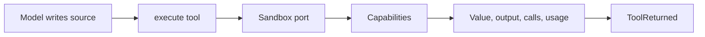

# Code Mode

Code mode lets the model write a script instead of a chain of tool calls. One model call then drives many operations, and the intermediate values stay inside the sandbox rather than passing through the context window.

`flamecast-core/codemode` is a separate package because it is one interface policy among several. An agent reaches its tools through provider-native calling, code mode, MCP, textual commands, or a generic RPC operation, and the choice belongs to the harness developer.

## The Shape



Three pieces compose:

- A capability is one named object the script can reach. The list is what a harness developer chooses, so the sandbox surface is application vocabulary.
- The `Sandbox` port runs source against those capabilities. Everything platform-specific sits behind it.
- `codemode(options)` binds them into an ordinary native tool.

```ts
import { createAgent, defaultPack } from "flamecast-core/harness"
import { agents, codemode } from "flamecast-core/codemode"

const execute = codemode({ capabilities: [agents({ allow: ["worker/*"] })] })

const lead = createAgent({ modules: defaultPack({ nativeTools: [execute] }) })
```

The tool's description carries the capability surface, so the model reads what it can call in the place it already looks. A capability declares each method as a signature string, because the reader is a writer of code and the sandbox rejects a bad call at the call site.

## One Tool, Not a New Alphabet

Code mode adds no event type. `ToolCalled` records the source, `ToolReturned` records the outcome, and a settle that finds a committed `ToolReturned` never runs the script again. Dispatch, the budget wall, dedup, and replay all come from the machinery that serves every other tool.

The script's own effects are recorded where they land. A delegation from inside a script records the crossing in the child's log through `origin`, so the delegation tree stays derived. [Orchestration](orchestration.md#the-boundary-contract) covers the contract.

## Delegation Inside a Script

The `agents` capability is where code mode earns its keep for multi-agent work. Fan-out is `Promise.all`, the join is the language's own await, and a retry or a deadline is an ordinary combinator, so no gather protocol needs to exist.

```ts
const answers = await Promise.all([
  agents.call("worker/1", "summarize the first half"),
  agents.call("worker/2", "summarize the second half")
])
return answers.map((one) => one.output).join("\n")
```

Call ids come from the script's evaluation order, so a script that runs twice asks the same questions and each child absorbs the repeat as a redelivery. A re-run after a crash is cheap because the children answer from their logs.

`allow` names the addresses a script may reach, as exact names or `prefix/*` patterns. A deployment that runs model-written source states the list, and a call outside it returns an error without routing.

## Spend and the Budget Wall

A script is one call at the budget wall, so two limits keep it honest. `maxCalls` caps capability calls in one script. The result carries the usage its capabilities reported, so `treeUsageIn` still sees what the script spent. Any capability that reaches a model reports usage the same way, and reporting it is the whole contract. [Observability](observability.md#cost-projections) covers the projections.

## Binding a Sandbox

`inProcessSandbox()` returns a service value that runs source in this process with the surrounding globals reachable. It is an execution surface rather than a security boundary, and it suits development, tests, and source that is already trusted.

```ts
Layer.succeed(Sandbox, inProcessSandbox())
Context.make(Sandbox, inProcessSandbox())
```

The first binds it for a turn, and the second hands it to a runtime through `services`. Bind an isolating implementation, such as a worker, an isolate, or a micro-VM, to run source a model wrote against data the model should not reach. The port carries source, names, and an outcome, so an out-of-process sandbox proxies each capability call over its own channel without changing what an agent offers.

## Writing a Capability

```ts
import { Effect } from "effect"
import { capability } from "flamecast-core/codemode"

const invoices = capability({
  name: "invoices",
  summary: "Read invoices for the current tenant.",
  methods: [
    {
      name: "lookup",
      signature: "lookup(orderId): Promise<Invoice>",
      description: "One invoice by order id.",
      run: (args) => Effect.promise(() => store.lookup(String(args[0])))
    }
  ]
})
```

A method returns an Effect, so it reaches services the same way a machine does. The requirements of every capability become the requirements of the tool, and the runtime provides them through `services`.
