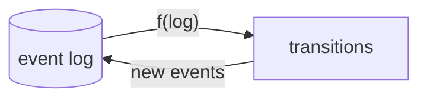
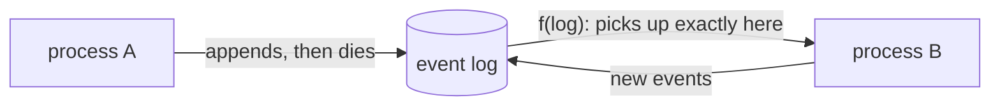
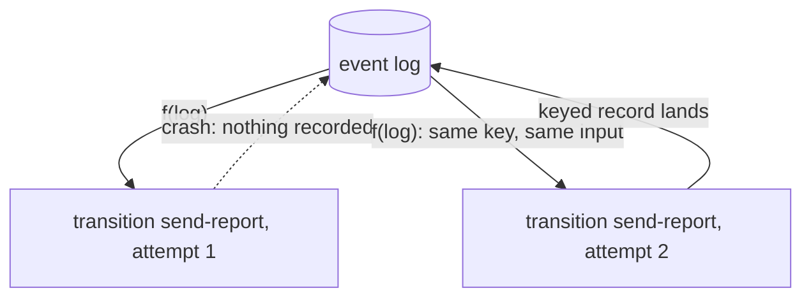
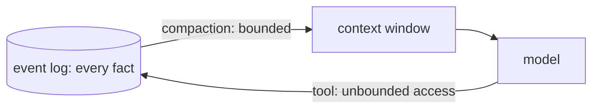
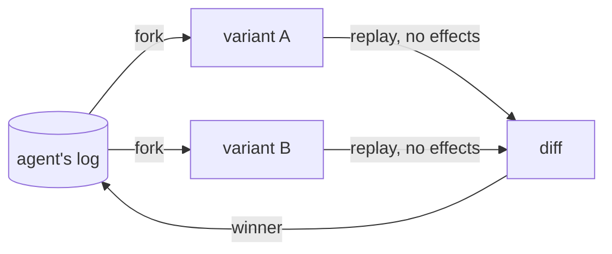

### Log is all you need
There are plenty of agent harnesses out there, and all of them are more complex than they have to be. Designing a harness is not very different from designing a user interface, except here the user is a language model. Once you adopt this view, harness design turns into a state management and rendering problem.

React solved this for the DOM by declaring the component tree as a function of state: `UI = f(state)`. Less known is that the set of valid state transitions is also derived from the same function: [`{transitions} = f(state)`](https://jordaneldredge.com/blog/transitions-f-of-state/)[^eldredge]. The beauty of this design is that the author does not have to explicitly enumerate all possible states (spoiler alert: it's [impossible](https://doi.org/10.1016/0167-6423%2887%2990035-9)[^harel]!). With transitions as a function of state, one function implies every state and every valid transition between them.

A harness needs the same shape as React, but with the log as state. Tobi Lutke (CEO, Shopify) echoed a similar idea in an August 2026 [post](https://x.com/tobi/status/2086192833061323111)[^tobi]: "everything that can be will be converted into `state = memo { f(log) }`... all other state management is just too complex at the limit." We take this idea further: a harness can be described simply as

$$  
\{\mathrm{transitions}\} = f(\mathrm{log})  
$$

Most of the existing harnesses already implement a log as an important feature, but none take it all the way. The decision logic lives scattered across workflows, hooks, state registers. The log is the source of truth for what happened, but not what will happen.

Tardigrade is an agent harness built with the log as its core, inspired by event sourcing and React. State at any point is a pure function of the log, and the harness is a set of transitions derived from it. The result is an expressive, modular way to design agent harnesses, and one that makes them durable, lightweight, and debuggable.



### Example
To make things concrete, take a look at this event log of an agent:

| # | event | payload |
|---|---|---|
| 1 | `MessageReceived` | "what changed in the deploy?" |
| 2 | `ToolCalled` | callId: c1, name: git_log |
| 3 | `ToolReturned` | callId: c1, result: "3 commits..." |
| 4 | `ToolCalled` | callId: c2, name: read_diff |
| 5 | `ToolReturned` | callId: c2, result: "+42 -7 in api/..." |
| 6 | `TurnCompleted` | "The deploy added rate limiting to the api..." |

To build a simple agent with tool calling, we need two transitions, both of which are pure functions over the log. The first one is `infer`, whose rule would be: "if there is a `MessageReceived` without a `TurnCompleted`, and every previous message is answered, translate the log into a conversation history and call a language model". The second one is `tools`, whose rule would be "if there is a `ToolCalled` without a matching `ToolReturned`, run that tool".

```ts
// infer: enabled when a message is open and every call is answered.
const infer: Reactor = (events) => {
  if (done(events)) return []
  if (unansweredCalls(events).length > 0) return []
  const attempt = events.filter((e) => e.type === "ToolReturned").length
  return [{ key: `llm/${attempt}`, input: events, act: runLlm }]
}

// tools: one transition per unanswered call.
const tools: Reactor = (events) =>
  unansweredCalls(events).map((call) => ({ key: call.callId, input: call, act: runTool }))
```

We can apply the same simple logic of pure functions over the log to build more and more complex features of a harness like compaction, recursive language models and so on. More of this would be explored in the tutorials.
### What this enables
#### Serverless harness
A running process on the edge can crash at any moment. However, the death of a process should not mean a permanent failure. With tardigrade, state is a pure function of the log. The platform can evict or kill the process at any point without affecting the outcome; the agent starts exactly where it left off when the next process picks up the log. Actor platforms that couple compute with private state, like Cloudflare's [Durable Objects](https://developers.cloudflare.com/durable-objects/) and Deno's [celld](https://github.com/denoland/celld), are a particularly good fit for this model. They cost nothing when unused, and a thousand users is a thousand small logs.



#### Durable effects
If a process is disposable, how do we ensure that any work that was mid-flight gets done if the process crashes? In tardigrade, every transition has a key derived from the log. If the process crashes in flight, it leaves the transition unrecorded. When a new process starts, it re-derives the exact same transition and retries it, since transitions are a pure function of the log. Every effect runs at least once and is recorded in the log exactly once. The transition key also functions as an idempotency key for providers that accept one.



#### Bitter-lesson pilled harnesses
Interfaces are inherently restrictive when they compress information based on the capability of the user. A highly capable user needs the least amount of compression and the least compressive interface is the log. It holds every fact, and a user can derive any view out of it. For example, a memory framework is the log with a tool to access it. Compaction bounds what enters the context window; a tool lets the model reach everything outside it. This gives bounded context with unbounded access. [PRO-LONG](https://arxiv.org/abs/2607.20064)[^prolong] showed this on ARC-AGI-3: a complete append-only log plus search tools beat specialized harnesses at a fraction of the tokens. [Recursive Language Models](https://arxiv.org/abs/2512.24601)[^rlm] are the same shape over long contexts. A harness should set a floor, never a ceiling, for the next generation of models.



#### Self-improving harness
Agents are becoming the new authors of agent harnesses. This idea has been explored as [meta-harnesses](https://arxiv.org/abs/2603.28052)[^metaharness], and harnesses are increasingly seen as the [near-term substrate for self-improvement](https://lilianweng.github.io/posts/2026-07-04-harness/)[^weng]. That requires a harness that is modular and interpretable. Since state and transitions are pure functions of the log, a meta-harness can fork an agent's state from any point of its history, make changes, and run multiple experiments with new harness modules (tardigrade calls them reactors). Observability and experimentation ergonomics should never be strapped onto a harness; they are important enough to be native.



### Why Tardigrade
If you haven't heard of tardigrades, they are the most indestructible animals we know of. They can survive vacuum, radiation, freezing, and decades without water by turning into a kernel that holds everything needed to come back alive. This harness tries to be the same for agents. Everything it is, and everything it will be, is derived from a durable append-only log. And a log is very hard to kill.
### References
[^eldredge]: Jordan Eldredge, [{transitions} = f(state)](https://jordaneldredge.com/blog/transitions-f-of-state/), 2025.
[^harel]: David Harel, [Statecharts: A Visual Formalism for Complex Systems](https://doi.org/10.1016/0167-6423%2887%2990035-9), Science of Computer Programming, 1987.
[^tobi]: Tobi Lutke, [post on X](https://x.com/tobi/status/2086192833061323111), August 2026.
[^prolong]: Alexis Fox, Junlin Wang, Paul Rosu, Bhuwan Dhingra, [PRO-LONG: Programmatic Memory Enables Long-Horizon Reasoning](https://arxiv.org/abs/2607.20064), 2026.
[^rlm]: Alex Zhang, Tim Kraska, Omar Khattab, [Recursive Language Models](https://arxiv.org/abs/2512.24601), 2025.
[^metaharness]: Yoonho Lee, Roshen Nair, Qizheng Zhang, Kangwook Lee, Omar Khattab, Chelsea Finn, [Meta-Harness: End-to-End Optimization of Model Harnesses](https://arxiv.org/abs/2603.28052), 2026.
[^weng]: Lilian Weng, [Harness Engineering for Self-Improvement](https://lilianweng.github.io/posts/2026-07-04-harness/), Lil'Log, 2026.

