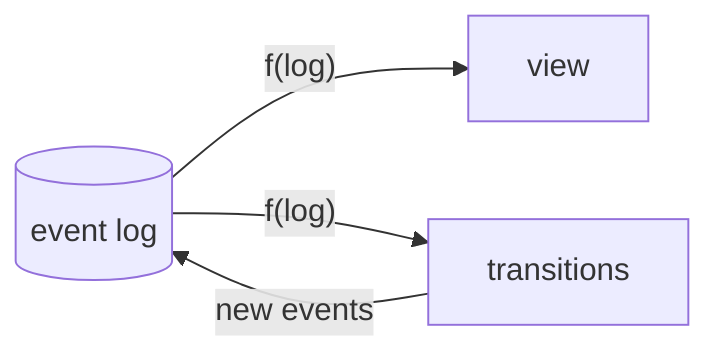
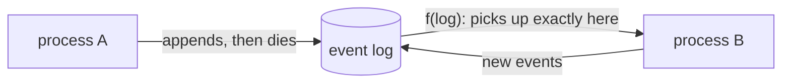
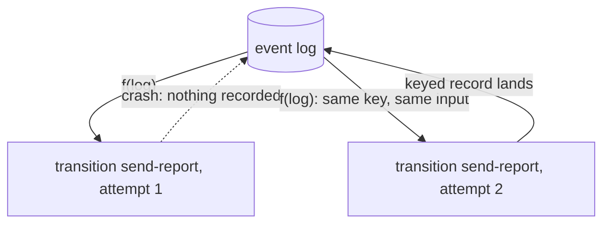
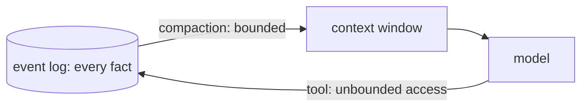
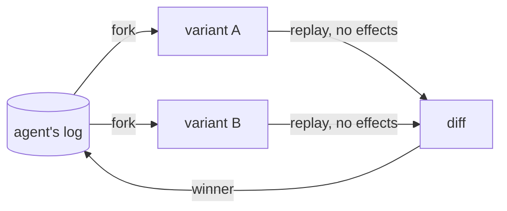

### A harness made for self-improvement

Building and running an agent in production is tough. Your agents can fail for a thousand reasons. When a run eventually goes wrong in production, you don't have much control. You change a few prompts, write a new eval case, and hope it doesn't run into a similar situation in the future. Any form of customization is wrestling against the harness, and changing one part might affect the rest in unpredictable ways.

As models get increasingly smart, they will be capable of writing their own harnesses to improve themselves. To enable this, we need a harness that can be inspected, forked, and varied.
### Log is all you need
How can a harness be fully customizable, easy to author, and yet remain reliable in production? We took inspiration from React. Designing a harness is like designing a user interface, except the user is a language model. React derives its component tree and declared effects from state, `{ UI, effects } = f(state)` [1]. A harness has the same shape over its event log, `{ view, transitions } = f(log)`, with transitions grounded in Harel's statecharts [2]. A transition is either an intent that proposes events or an external effect. This simplicity enables expressive authoring without sacrificing reliability.

Tobi Lütke (CEO, Shopify) echoed a similar idea in an August 2026 [post](https://x.com/tobi/status/2086192833061323111) [3]: "everything that can be will be converted into `state = memo { f(log) }`... all other state management is just too complex at the limit." We take this idea further: the view and all transitions of a harness can be described as one function over the log.

$$
\{\mathrm{view},\ \mathrm{transitions}\} = f(\mathrm{log})
$$



### Example

To make things concrete, take a look at this event log of an agent:

|#|event|payload|
|---|---|---|
|1|`MessageReceived`|"what changed in the deploy?"|
|2|`ToolCalled`|callId: c1, name: git_log|
|3|`ToolReturned`|callId: c1, result: "3 commits..."|
|4|`ToolCalled`|callId: c2, name: read_diff|
|5|`ToolReturned`|callId: c2, result: "+42 -7 in api/..."|
|6|`TurnCompleted`|"The deploy added rate limiting to the api..."|

To build a simple agent with tool calling, we need two reactors: functions that derive transitions from the log. The first one is `infer`, whose rule would be: "if there is a `MessageReceived` without a `TurnCompleted`, and every call is answered, translate the log into a conversation history and call a language model". The second one is `tools`, whose rule would be: "if there is a `ToolCalled` without a matching `ToolReturned`, run that tool".

```ts
// infer: enabled when a message is open and every call is answered.
const infer: Reactor = (events) => {
  if (done(events)) return []
  if (unansweredCalls(events).length > 0) return []
  const attempt = events.filter((e) => e.type === "ToolReturned").length
  return [{ key: `llm/${attempt}`, input: events, act: runLlm }]
}

// tools: one transition per unanswered call.
const tools: Reactor = (events) =>
  unansweredCalls(events).map((call) => ({ key: call.callId, input: call, act: runTool }))
```

The same logic of functions over the log builds the more complex features of a harness, like compaction and recursive language models. The [quickstart](../quickstart.md) builds these reactors in full, and [examples/quickstart.ts](../../examples/quickstart.ts) runs them.

### What this enables

#### Serverless harness

A running process on the edge can crash at any moment. However, the death of a process should not mean a permanent failure. With tardigrade, state is a pure function of the log. The platform can evict or kill the process at any point without affecting the outcome; the agent starts exactly where it left off when the next process picks up the log. Actor platforms that couple compute with private state, like Cloudflare's [Durable Objects](https://developers.cloudflare.com/durable-objects/) and Deno's [celld](https://github.com/denoland/celld), are a particularly good fit for this model. They cost nothing when unused, and a thousand users is a thousand small logs.



#### Durable effects

If a process is disposable, how do we ensure that any work that was mid-flight gets done if the process crashes? In tardigrade, every transition has a key derived from the log. If the process crashes during an external effect, it leaves that transition unrecorded. When a new process starts, it re-derives the same transition and retries it because transitions are a pure function of the log. Every external effect runs at least once and its keyed result is recorded once. The transition key also functions as an idempotency key for providers that accept one.



#### Bitter-lesson pilled harnesses

Interfaces are inherently restrictive when they compress information based on the capability of the user. A highly capable user needs the least amount of compression, and the least compressive interface is the log. It holds every fact, and a user can derive any view out of it. For example, a memory framework is the log with a tool to access it. Compaction bounds what enters the context window; a tool lets the model reach everything outside it. This gives bounded context with unbounded access. [PRO-LONG](https://arxiv.org/abs/2607.20064) [4] showed this on ARC-AGI-3. [Recursive Language Models](https://arxiv.org/abs/2512.24601) [5] are the same shape over long contexts. A harness should set a floor, never a ceiling, for the next generation of models.



#### Self-improving harness

Agents are becoming the new authors of agent harnesses. This idea has been explored as [meta-harnesses](https://arxiv.org/abs/2603.28052) [6], and harnesses are increasingly seen as the [near-term substrate for self-improvement](https://lilianweng.github.io/posts/2026-07-04-harness/) [7]. That requires a harness that is modular and interpretable. Since state and transitions are pure functions of the log, a meta-harness can fork an agent's state from any point of its history, make changes, and run multiple experiments with new reactors. Observability and experimentation ergonomics should never be strapped onto a harness; they are important enough to be native.



### References

1. Jordan Eldredge, [{transitions} = f(state)](https://jordaneldredge.com/blog/transitions-f-of-state/), 2025.
2. David Harel, [Statecharts: A Visual Formalism for Complex Systems](https://doi.org/10.1016/0167-6423%2887%2990035-9), Science of Computer Programming, 1987.
3. Tobi Lütke, [post on X](https://x.com/tobi/status/2086192833061323111), August 2026.
4. Alexis Fox, Junlin Wang, Paul Rosu, Bhuwan Dhingra, [PRO-LONG: Programmatic Memory Enables Long-Horizon Reasoning](https://arxiv.org/abs/2607.20064), 2026.
5. Alex Zhang, Tim Kraska, Omar Khattab, [Recursive Language Models](https://arxiv.org/abs/2512.24601), 2025.
6. Yoonho Lee, Roshen Nair, Qizheng Zhang, Kangwook Lee, Omar Khattab, Chelsea Finn, [Meta-Harness: End-to-End Optimization of Model Harnesses](https://arxiv.org/abs/2603.28052), 2026.
7. Lilian Weng, [Harness Engineering for Self-Improvement](https://lilianweng.github.io/posts/2026-07-04-harness/), Lil'Log, 2026.
