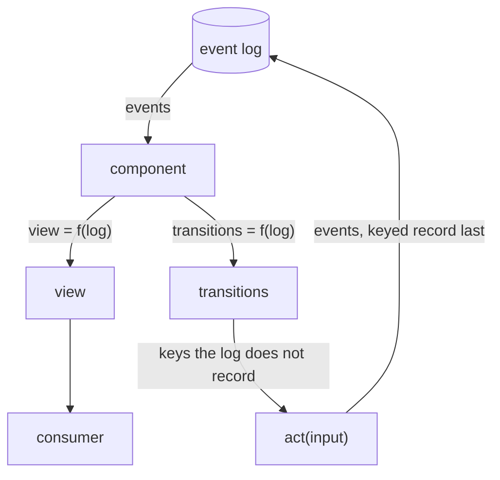
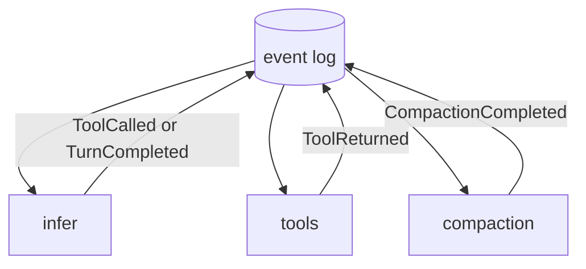

Welcome to the tardigrade documentation. This page will give you an introduction to the core concepts of tardigrade and teach you how to build your custom agent harness.
### Events
Events are the smallest primitive of tardigrade. It's an immutable fact, keyed and recorded once in the event log. You can define events based on what you find meaningful in your domain. For a simple agent, the events could be `MessageReceived`, `ToolCalled` etc. However, you could easily extend this to include other events specific to your workflows like `InvoiceReceived`.

```ts
// An Event is an open record
type Event = { type: string } & Record<string, unknown>

// Concrete events narrow the shape. These four are the agent's vocabulary.
type MessageReceived = { type: "MessageReceived"; text: string }
type ToolCalled = { type: "ToolCalled"; callId: string; name: string; arguments: unknown }
type ToolReturned = { type: "ToolReturned"; callId: string; result: unknown }
type TurnCompleted = { type: "TurnCompleted"; output: string }
```

### Projections
A projection is a pure function from the event set to a value. Everything else in tardigrade is derived from the log, and a projection is that derivation, named.

```ts
// A Projection derives a value from the event set. It is pure and ignores
// event order; it is recomputed on every read, never stored, never appended.
type Projection<T> = (events: Event[]) => T
```

```ts
// done: the turn has reached its terminal.
const done: Projection<boolean> = (events) =>
  events.some((e) => e.type === "TurnCompleted")
```

Notice there is no cache and no invalidation: the log is the source, so a projection can never be stale. If a piece of logic appends nothing, it is a projection, never a reactor; reactors exist only for work that must land in the log.
### Transition
A transition defines a valid state change. On a high level, it takes in state and outputs new events. For example, a simple transition for an agent would be one that takes in a conversation history and outputs a new LLM response.

```ts
// key and input are projections of the event set, so a retried fire is the
// same work, absorbed by its key (tla/Reactor.tla, CommitOne). act may be
// nondeterministic.
type Transition<T, E extends Event = Event> = {
  key: string
  input: T
  act: (input: T) => Promise<E[]>
}
```
### Reactor

A reactor derives the transitions the log enables. It takes the event log and returns the transitions whose work is due; the runtime fires each transition whose key the log does not record and appends the results, keyed record last.
```ts
// A Reactor derives the transitions the log enables. It must ignore event
// order (tla/Projection.tla, ViewFaithful). The runtime fires each key the
// log does not record and appends the results, keyed record last.
type Reactor = (events: Event[]) => Transition[]
```
### Component

A component derives a view and transitions from the same log. The view is available to a consumer such as the agent runtime, while transitions go to actor reconciliation. Either side may be empty.

```ts
type Derivation<V> = {
  view: V
  transitions: Transition[]
}

type Component<V> = {
  name: string
  derive: (events: Event[]) => Derivation<V>
}
```

Components compose when their view type has an explicit combination rule. Transitions concatenate in component order. The view rule states how values combine, including ordering and collision policy.

```ts
type ViewAlgebra<V> = {
  empty: V
  combine: (left: V, right: V) => V
}
```
### Actor

An actor is one event log and the reactors over it. The log is mailbox and state at once: a send lands as an event, reactors derive what it enables, fires append the results, and the new events enable the next round. Settling ends when no reactor enables a transition. `reactorOf(component)` adapts a component's transition projection to this unchanged runtime.
```ts
// An Actor is the single writer of one log and the reactors over it. The
// platform serializes sends per actor, so appends never race
// (tla/Projection.tla).
type Actor = { reactors: Reactor[] }

// send appends one event and settles the actor.
const send = async (actor: Actor, event: Event): Promise<void>
```
### Architecture



### Example: a simple agent with tools
An agent is three reactors over one log. The complete runnable version of this example lives at [examples/quickstart.ts](../examples/quickstart.ts); run it with `bun run examples/quickstart.ts`.
#### Tools
**Running tools.** Start with a projection: which calls have no result yet?

```ts
// unansweredCalls: the tool calls with no matching result.
const unansweredCalls: Projection<ToolCalled[]> = (events) =>
  events
    .filter((e) => e.type === "ToolCalled")
    .filter((c) => !events.some((e) => e.type === "ToolReturned" && e.callId === c.callId))
```

Notice that "unanswered" is the absence of an event. Absences are state too, and only a function over the whole set can see one.

```ts
// runTool executes one call.
const runTool = async (call: ToolCalled): Promise<ToolReturned[]> =>
  [{ type: "ToolReturned", callId: call.callId, result: await toolbox[call.name](call.arguments) }]

// tools: one transition per unanswered call.
const tools: Reactor = (events) =>
  unansweredCalls(events).map((call) => ({ key: call.callId, input: call, act: runTool }))
```
#### Inference
**Inference.** The other reactor asks the model what to do next.

```ts
// runLlm does one inference. The action lands as an event.
const runLlm = async (trajectory: Event[]): Promise<(ToolCalled | TurnCompleted)[]> => {
  const action = await model(trajectory)
  return action.kind === "call"
    ? [{ type: "ToolCalled", callId: action.callId, name: action.name, arguments: action.arguments }]
    : [{ type: "TurnCompleted", output: action.output }]
}

// infer: an inference is enabled when every call is answered and no terminal yet.
const infer: Reactor = (events) => {
  if (done(events)) return []
  if (unansweredCalls(events).length > 0) return []
  const attempt = events.filter((e) => e.type === "ToolReturned").length
  return [{ key: `llm/${attempt}`, input: events, act: runLlm }]
}
```

Notice the key: the count of answered calls. A crashed inference never records `llm/2`, so the next settle derives `llm/2` again and retries the same attempt. Durability, with no retry code.
#### Compaction
**Compaction.** The loop appends forever, and the trajectory grows with it. Keeping it small requires a reactor. Assume a token estimate `sizeOf(events)` and a `BUDGET` it compares against.

```ts
// CompactionCompleted is the checkpoint: the summary so far, and the index it covers.
// A render reads the summary plus the events after upTo; nothing is deleted.
type CompactionCompleted = { type: "CompactionCompleted"; summary: string; upTo: number }

// lastCheckpoint: the latest checkpoint, or the empty one.
const lastCheckpoint: Projection<{ summary: string; upTo: number }> = (events) =>
  events.findLast((e) => e.type === "CompactionCompleted") ?? { summary: "", upTo: 0 }
```

```ts
// A Span is the stretch owed a summary: from the checkpoint it starts at,
// up to the index the next checkpoint will cover.
type Span = { summary: string; events: Event[]; from: number; upTo: number }

// spanOf: the span owed a summary, or null while the log is under budget.
const spanOf: Projection<Span | null> = (events) => {
  const checkpoint = lastCheckpoint(events)
  const since = events.slice(checkpoint.upTo)
  if (sizeOf(since) <= BUDGET) return null
  return { summary: checkpoint.summary, events: since, from: checkpoint.upTo, upTo: events.length }
}

// compact folds a span into the next checkpoint.
const compact = async (span: Span): Promise<CompactionCompleted[]> => {
  const summary = await summarize(span.summary, span.events)
  return [{ type: "CompactionCompleted", summary, upTo: span.upTo }]
}

// compaction: enabled when the events since the checkpoint outgrow the budget.
const compaction: Reactor = (events) => {
  const span = spanOf(events)
  if (!span) return []
  return [{ key: `compact/${span.from}`, input: span, act: compact }]
}
```

Notice the shape the projection leaves behind: the reactor is now three lines, and every reactor on this page has the same anatomy: a projection derives the input, the reactor keys it, the act does the work. `input` is always the output of a projection.
#### Agent
**The agent.** Put the three reactors on one log and send it a message.

```ts
const agent: Actor = { reactors: [infer, tools, compaction] }

await send(agent, { type: "MessageReceived", text: "What changed in the deploy?" })
```

This example constructs the low-level actor directly. The agent package groups related views and transitions into components, composes their views with a `ViewAlgebra`, and adapts their transitions into the same reactor list.
#### Architecture
The agent, as the loop: one log, three reactors deriving from it, fires landing back in it.



