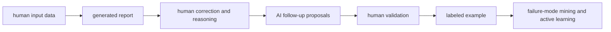

# Report calibration task

## Product decision

Define the first task for the [data collection platform](data-collection.md): teach an AI report generator what a good report looks like. The system has the contract `report = f(input)`. The input is a human conversation with its original question or context. The report contains a title and key takeaways.

A human labeler reads the conversation, reviews the generated report, approves accurate sections, corrects weak sections, and explains the judgment through text or voice. An AI reviewer then reads the source material, generated report, human revision, and human reasoning. It can propose further changes and explain each concern. The labeler accepts, edits, or declines every proposal.

The completed review preserves every stage instead of keeping only the final prose. These labeled examples support failure-mode mining, evaluation, and active learning for the report generator.

Human judgment defines the quality target. An AI concern or proposal remains a candidate until a labeler validates it. Model rank, priority, and confidence can order the interface, but they never become labels on their own.

## Review artifacts

| Stage | Artifact | Author |
| --- | --- | --- |
| Input | Original question and human conversation | Source users |
| Generated report | Title and key takeaways | Report generator |
| First review | Approved or edited sections with reasoning | Human labeler |
| Follow-up review | Concerns and proposed changes | AI reviewer |
| Final validation | Accepted, edited, or declined proposals with reasoning | Human labeler |
| Labeled example | Full lineage and final report | Review system |

The source conversation is evidence for the report. It remains immutable throughout review. Every revision records its author and source text so an exported example can reconstruct how the final report was reached.

## Input paths

### Dataset import

The admin imports JSONL into a report-calibration collection job. Each non-empty line is one review case. The platform validates records independently, shows the line and field for each error, and keeps valid records available for packet generation.

The current `dataset.jsonl` records have these fields:

| Field | Meaning |
| --- | --- |
| `id` | Stable review case identifier |
| `note_id` | Identifier of the generated note |
| `note_title` | Display title used in the review queue |
| `original_question` | Question or context that started the conversation |
| `transcript` | Ordered messages with `speaker_label`, `user_type`, and `message` |
| `sections` | The first human review of the generated title and key takeaways |
| `ai_suggestions` | Ranked AI follow-up proposals for the human-reviewed report |

Each entry in `sections` contains:

| Field       | Meaning                                                   |
| ----------- | --------------------------------------------------------- |
| `title`     | Report section name, currently `Title` or `Key takeaways` |
| `before`    | Original text from the report generator                   |
| `after`     | Text approved or edited by the first human reviewer       |
| `rationale` | Human explanation for the approval or correction          |

An unchanged `after` value means that the first reviewer approved the generated section. The rationale still carries useful evidence about why the section met the quality standard.

Each entry in `ai_suggestions` contains:

| Field                      | Meaning                                        |
| -------------------------- | ---------------------------------------------- |
| `id`                       | Stable suggestion identifier                   |
| `rank` and `priority`      | AI ordering hints shown to the labeler         |
| `section_title` and `span` | Section and text addressed by the suggestion   |
| `concern`                  | AI explanation of the possible problem         |
| `suggestion`               | Short description of the proposed fix          |
| `current_text`             | Human-reviewed section seen by the AI reviewer |
| `proposed_text`            | Full replacement proposed by the AI reviewer   |

Imported dataset cases open at final validation because the source, generated report, first human review, and AI follow-up are already present. The admin can divide these cases into review packets and issue unique URLs to labelers.

### Raw input

The raw-input path lets an admin start a new review case inside a collection job. The admin supplies the original question or context and pastes the human conversation. The interface previews message order and speaker labels before submission.

The configured report generator turns that input into a title and key takeaways. The labeler then completes the first review, and the AI reviewer produces follow-up suggestions from the saved result.

The raw-input form also accepts a generated title and key takeaways when the report was produced elsewhere. The case records the generator provenance as user-supplied when model, prompt, or version details are unavailable.

## Review workflow



### 1. Open an assigned case

The labeler opens a unique packet URL and chooses an assigned case. The packet shows the task instructions, progress, effective review policy, and completion state. The labeler cannot change the source record or access cases outside the packet.

### 2. Read the input and generated report

The generated report appears in the left column and the source input appears in the right column. Both remain visible at desktop widths. The report view clearly separates generator text from human text. A labeler can move between the title and key takeaways without losing the current scroll position in the conversation.

### 3. Complete the first human review

The labeler acts on each generated section:

- Approve keeps the generated text.
- Edit opens the generated text as an editable draft and records each correction as a suggested change against the immutable generator text.
- Reasoning records why the original text was acceptable or what needed correction.

The output column offers `Edit` and `Redline` views. `Edit` shows the clean working draft. `Redline` shows inserted text with an insertion treatment and deleted text with a deletion treatment, similar to suggestion mode in a document editor. The labeler can switch views without changing the draft.

The labeler can approve the full report when both sections are accurate. The saved result still contains one explicit decision for each section and preserves the original text, working text, and structured change set.

### 4. Run the AI follow-up

The AI reviewer receives the original question, complete conversation, generated report, first human revision, and first human rationale. Each proposal identifies a section and span, states a concern, explains the suggested fix, and provides proposed text.

The UI presents each proposed change as a redline against the current human-reviewed text. AI rank and priority remain visible as model output. They never apply a change or hide a lower-ranked proposal. The effective AI reviewer model, prompt version, and any suggestion cap appear with the result.

### 5. Validate every AI proposal

The labeler chooses one outcome for each proposal:

- Accept applies the AI's proposed text to the working report.
- Edit starts from the proposed text and saves the labeler's version.
- Decline keeps the current human-reviewed text.

Each outcome offers a text and voice reasoning field. The record stores the decision, accepted reasoning transcript, input mode, text before the decision, AI proposal, and resulting text.

Suggestions are reviewed in rank order while remaining individually selectable. When several suggestions address the same section, each accepted change is applied to the current working draft. A proposal that cannot be applied cleanly after an earlier decision becomes a visible conflict and requires an edit or decline. Applying a full stale replacement cannot silently erase an accepted change.

### 6. Complete and export the case

A case is complete after every generated section has a first-review decision and every AI proposal has a final decision. Cases with no AI proposals complete with the first human revision as the final report.

The completion view shows the final title and key takeaways beside a compact history of the generator output, human correction, AI proposals, final decisions, and reasoning. Export includes this history and the final report as structured JSON.

## Interface layout

The admin interface configures the task, imports JSONL or raw cases, previews validation, generates packets, and monitors submissions. Dataset controls remain in this interface.

The labeler interface uses the maximum available viewport width. It has no centered article-width container or fixed content-width cap. A compact header carries packet progress, case navigation, save state, and task actions without taking width from the review canvas.

The desktop review canvas has two persistent columns:

- The left output column contains the AI-generated title and key takeaways, the editable working report, redlines, AI proposal cards, final actions, and reasoning controls.
- The right input column contains the immutable original question and ordered human conversation.

```text
┌──────────────────────────────────────────────────────────────────────────────┐
│ Packet progress · case navigation · saved state · think aloud · submit      │
├──────────────────────────────────────┬───────────────────────────────────────┤
│ OUTPUT                               │ INPUT                                 │
│                                      │                                       │
│ Title                                │ Original question                     │
│ [Edit] [Redline]                     │                                       │
│ Editable report and inline changes   │ Human conversation                    │
│                                      │ Speaker · message                     │
│ Key takeaways                        │ Speaker · message                     │
│ Editable report and inline changes   │ Speaker · message                     │
│                                      │                                       │
│ AI proposals and decision controls   │ Immutable source                      │
├──────────────────────────────────────┴───────────────────────────────────────┤
│ Decision reasoning · voice transcript · accept, edit, or decline            │
└──────────────────────────────────────────────────────────────────────────────┘
```

The exported `DEFAULT_REVIEW_LAYOUT` uses an equal column split. A task can provide a different initial ratio, and the labeler can drag the divider. The effective ratio is visible, stays within usable minimum column widths, and persists for that labeler without changing the packet's task presentation.

Each column scrolls independently. The original question can remain pinned above the input conversation while long report sections and conversations move. Collapsing packet navigation into a drawer gives the two review columns priority on wide screens.

The active report section and suggestion remain linked. Selecting a suggestion highlights its target span in the output. A source reference also highlights and scrolls to the matching input message when the task data contains that reference. The interface uses trusted components for report sections, diffs, actions, text input, and voice input.

The approved OpenUI presentation can compose controls within each column through cards, progressive disclosure, or comparison blocks. It must preserve the full-width, two-column review contract at desktop widths. It cannot replace the side-by-side comparison with tabs, change task steps, change available decisions, mutate source data, or alter the submission contract. The packet records the approved presentation variant that the labeler saw.

On smaller screens, the source and review panes stack while the current decision and unsaved reasoning remain visible.

## Redline behavior

The generator output is the immutable baseline for the first human review. The human working draft is editable. The redline is derived from both values and never becomes the only stored representation.

The default `diffGranularity` is `word`, is exported with the layout policy, and can be overridden by the task. Insertions use an underline and labeled addition treatment. Deletions retain the removed text with a strike-through and labeled deletion treatment. Color supports these states without carrying their meaning alone.

Each change has a stable identifier, author, section, original span, replacement text, creation time, and state. Human changes begin as active corrections and become part of the first human revision when the section is saved. AI changes begin as proposals and require an explicit accept, edit, or decline decision.

Editing proposed AI text creates a human-authored replacement linked to the AI proposal. Accepting uses the proposed text, declining keeps the current working draft, and reverting a human correction restores the affected generator text. Undo and redo operate on the working draft without deleting the recorded review history after save.

Redline computation respects report structure. Title changes stay within the title section, takeaway bullets remain separate blocks, and a change cannot silently merge or reorder sections. When automatic alignment is ambiguous, the UI shows the affected blocks as a replacement and asks the labeler to confirm the resulting text.

## Voice reasoning

Voice is available anywhere the labeler can explain a decision. Recording begins only after an explicit action and shows a persistent recording state, elapsed time, and stop control.

A focused microphone records reasoning for one section or proposal. A `Think aloud` control can remain active as the labeler reads, edits, and moves between decisions. The system segments this transcript and associates each segment with the section or proposal that was active when the speech began. The association is visible and editable before completion.

Speech is transcribed into the same reasoning field used for typed feedback. The labeler can edit the transcript before saving, combine speech with typed text, or discard the recording. A transcription failure preserves any typed text and leaves the decision unsubmitted.

The default retention policy is `discard-after-transcription`: the accepted transcript is stored and raw audio is discarded. The application exports this default, accepts a project override, and shows the effective policy beside the microphone control and in the completed example.

Voice capture never submits a review action or changes report text. The labeler confirms the reasoning and decision separately. A delayed transcription result keeps its speech-start association instead of attaching itself to whatever item is active when transcription finishes.

### Transcription adapter

The default adapter uses OpenAI [`gpt-transcribe`](https://developers.openai.com/api/docs/models/gpt-transcribe) through the file transcription endpoint. The browser records `audio/webm;codecs=opus` when supported and `audio/mp4` as the Safari fallback, then sends the completed blob to an authenticated application endpoint. The server forwards it to the transcription provider and keeps provider credentials out of the browser.

Recorded upload is the default interaction because a labeler needs an accurate editable note after speaking and the implementation needs no live socket or partial-result reconciliation. The interface shows a processing state after stop, inserts the completed transcript into the reasoning field, and preserves the audio locally only until the configured retention action completes.

The [file transcription contract](https://developers.openai.com/api/docs/guides/speech-to-text) accepts WebM and MP4 with a 25 MB provider limit. The application exports its transcription policy, accepts a lower task or project limit, and shows the effective recording duration and byte limits before capture. Longer `Think aloud` sessions become separate timestamped segments instead of crossing the provider limit.

The current OpenAI [data controls](https://developers.openai.com/api/docs/guides/your-data) list `/v1/audio/transcriptions` as unused for training, with no abuse-monitoring retention, no application-state retention, and Zero Data Retention eligibility. The application still applies its own explicit audio retention policy before and after the provider request.

The adapter contract supports a live provider when user testing shows that interim text materially improves review speed. A live adapter must expose partial and final transcript states, reconnect behavior, endpointing, provider retention, and cost as effective configuration. The report task needs no speaker diarization because one labeler supplies the microphone audio.

## Labeled example contract

A completed example preserves enough information to replay and learn from the judgment:

```ts
type ProposalOutcome = "accepted" | "edited" | "declined";

interface CompletedReportReview {
  readonly caseId: string;
  readonly input: {
    readonly originalQuestion: string;
    readonly transcript: ReadonlyArray<ConversationMessage>;
  };
  readonly generator: GeneratorProvenance | "user-supplied" | "unknown";
  readonly generatedSections: ReadonlyArray<ReportSection>;
  readonly firstHumanReview: ReadonlyArray<SectionReview>;
  readonly aiReviewer: ReviewerProvenance | "imported" | "unknown";
  readonly proposals: ReadonlyArray<AiProposal>;
  readonly finalDecisions: ReadonlyArray<{
    readonly proposalId: string;
    readonly outcome: ProposalOutcome;
    readonly reasoning: HumanReasoning;
    readonly resultingText: string;
  }>;
  readonly finalSections: ReadonlyArray<ReportSection>;
  readonly effectiveAudioRetention: AudioRetentionPolicy;
}
```

The stored lineage gives different learning signals:

- An approved generated section is a positive example of report quality.
- A first-review edit pairs a generator mistake with a human correction and explanation.
- An accepted AI proposal shows that the follow-up found a useful improvement.
- An edited AI proposal shows that its direction required a human correction.
- A declined AI proposal is a counterexample for that suggestion and its stated concern.

The system preserves these signals as separate fields. Flattening them into final report text would lose who made each judgment and why.

## Active learning loop

Completed reviews form the labeled pool for report calibration. A mining process can cluster repeated correction reasons, connect them to source and output patterns, and propose candidate failure modes. Human decisions remain the authority for whether those candidates describe report quality.

The active learning sampler can prioritize cases where the report generator or AI reviewer is uncertain, where reviewers disagree, or where a candidate failure mode needs more evidence. Any sampling threshold, queue cap, or confidence cutoff is explicit configuration. The UI shows why a case entered the queue and which effective policy selected it.

Model training, prompt changes, and deployment remain separate controlled actions. Each evaluation or training export names the exact labeled examples and generator versions it uses.

## Product boundary

The first product slice includes:

- Admin JSONL upload with per-record validation and packet generation.
- Admin raw human-conversation input and report generation.
- A review queue with resumable case state.
- Side-by-side source, generated report, and human revision views.
- Full-width, resizable output and input columns at desktop widths.
- Editable output with clean and redline views for human and AI changes.
- Approval, editing, and reasoning for the title and key takeaways.
- AI follow-up proposals with concerns, diffs, and rationale.
- Final accept, edit, and decline actions.
- Editable voice transcription for human reasoning.
- Structured export with full provenance and revision history.
- Unique packet URLs and the shared orchestration behavior defined in [data-collection.md](data-collection.md).

The first product slice excludes:

- Automatic prompt updates, fine-tuning, or deployment.
- Arbitrary generated interface code.
- Multi-labeler adjudication.

## Acceptance criteria

- An admin can upload the provided JSONL dataset, divide every valid record into packets, and issue unique review URLs.
- An admin can paste a human conversation and generate a report case for packet assignment.
- A labeler can open an assigned packet and review the report title and key takeaways without access to unassigned cases.
- The source question, conversation, and original generator text remain immutable and visible during review.
- At desktop widths, the editable output and immutable input remain visible side by side across the available viewport width.
- A labeler can resize the output and input columns, and the interface preserves a usable view of both.
- Every edit can be viewed as a redline against its correct baseline with insertions, deletions, authorship, and decision state.
- The first review records an explicit approval or edit and reasoning for each report section.
- Imported `before`, `after`, and `rationale` values render as the generator output and first human review.
- Every AI suggestion shows its target, concern, suggested fix, current text, proposed text, rank, and priority.
- A labeler can accept, edit, or decline every AI suggestion without losing earlier accepted changes.
- A labeler can record, edit, save, or discard a voice transcript while preserving typed feedback.
- A review resumes after reload with its current draft, decisions, and reasoning intact.
- Completion produces a final report and a structured example with source data, revisions, decisions, reasoning, provenance, and effective policy values.

## Success measures

The primary measure is useful human judgment collected per minute of labeler time. Supporting measures include review completion time, report approval rate, correction rate by section, reasoning completion rate, voice usage, accepted and edited AI proposal rate, declined proposal rate, inter-reviewer agreement, recurring failure modes found, and improvement on held-out report-quality examples.
