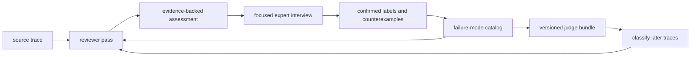

# Trace review and eval discovery

## Product decision

Build a project-scoped reviewer agent that turns agent traces and sparse human feedback into a durable failure-mode catalog, labeled examples, and draft eval judges.

The reviewer reads a trace before asking for help. It reconstructs the task, assesses overall success, checks known failure modes, searches for new failure modes, and cites the exact trace evidence behind each claim. It then interviews a domain expert only where their answer can resolve an important uncertainty. The expert can answer with voice, text, or a small structured control. Each answer updates project memory, so later reviews reuse settled definitions and avoid repeated questions.

The first durable output is a versioned failure-mode catalog with positive examples, counterexamples, and trace-level detections. The next output is a judge bundle that checks overall task success and each confirmed failure mode independently. A complete RL environment, model optimization, and data sales remain downstream uses of these artifacts.

## Why this product exists

AI application teams already have traces, support reports, Slack discussions, thumbs-down events, and corrections. These sources contain useful signals, yet they do not state a stable eval contract. Product managers and domain experts understand the intended behavior, but raw span trees and JSON payloads make them do observability work before they can give useful feedback. Engineers can collect labels, but often lack a method for turning those labels into representative evals.

The missing layer is an active reviewer that does the first pass, asks focused follow-up questions, and accumulates the answers into reusable evaluation knowledge.

## Target users

The primary operator is an AI product engineer or eval engineer who owns an agent and its traces. The primary reviewer is a product manager, domain expert, support lead, or power user who can judge expected behavior and has little time for manual labeling.

The same workflow can support two commercial paths. An application team can use the catalog and judges to improve its own agent. A data or environment provider can use the approved artifacts to prepare high-quality eval data for a lab. The first build does not choose between these buyers because both need the same trace-to-eval loop.

## Product boundary

| Build now | Build after the loop works | Separate business bet |
| --- | --- | --- |
| Import a Tardigrade trace | Braintrust, OpenTelemetry, and other trace adapters | A marketplace for selling data or environments |
| Review one trace at a time | Automated trace sampling and triage queues | Revenue sharing and data valuation |
| Assess success, known failures, and novel failures | Calibrated unattended classification | Passive screen recording for service workers |
| Interview through chat, voice, and typed question blocks | Slack as an alert and deep-link channel | An inference gateway with customer-specific models |
| Remember confirmed and rejected interpretations | Judge validation and regression reporting | Automated prompt tuning or fine-tuning |
| Export structured assessments and the catalog | Generate and validate a draft judge bundle | Arbitrary generated application code |

## Core loop



The loop has two kinds of learning. A trace-level detection says whether a known failure occurred in one run. A catalog change defines, revises, rejects, or merges the reusable failure mode itself. Keeping these separate prevents a model guess from silently becoming product policy.

## User workflow

### 1. Create a review project

A project names the agent or product being reviewed and holds its context, failure-mode catalog, review policy, and judge versions. Product context can include repository files, prompts, requirements, and links. Context is optional for the first trace and can grow through the interview.

### 2. Add a source trace

The operator selects a Tardigrade actor and thread or uploads the same event log as JSON. The import records an immutable source reference, a snapshot boundary, and any existing signal such as a thumbs down, correction, support message, or reviewer note. The original trace remains unchanged.

### 3. Run the reviewer pass

The reviewer reconstructs the user's goal, the agent's final outcome, and the earliest consequential divergence it can support with evidence. It produces four independent results:

- Overall task result: `success`, `failure`, or `unclear`.
- Known-mode detections: one `present`, `absent`, or `unclear` verdict for each relevant confirmed failure mode.
- Novel-mode candidates: reusable failure predicates that do not match the current catalog.
- Missing context: facts that prevent a sound decision.

Every failure claim includes observed behavior, expected behavior, consequence, and one or more event references. The reviewer can inspect the whole trace through paged tools. It cannot claim full coverage when policy or source availability hides part of the trace.

### 4. Interview the expert

The reviewer orders questions by expected decision value. It first resolves the task goal or expected outcome when those are unclear. It then asks about a novel candidate, a disputed known-mode detection, or the boundary between two similar modes. It asks one question at a time and explains what decision the answer affects.

The interview supports these typed question blocks:

- Confirm or reject a proposed failure.
- Edit the expected behavior or reusable definition.
- Choose among likely interpretations.
- Select the first incorrect event or relevant evidence.
- Supply a corrected output or action.
- Give free-form feedback by voice or text.

Voice is an input method for every free-form answer. The transcript is editable before submission. The default audio policy discards audio after transcription and stores the accepted transcript. A project can override that policy, and the review shows the effective choice.

### 5. Commit the review

The expert's answer can confirm, revise, reject, or merge a candidate. A confirmed mode gains a stable definition and a positive example. A rejected interpretation remains as a counterexample or explicit boundary, so the reviewer can avoid asking the same semantic question on a later trace. Each detection records whether it came from the model, a human, or both.

### 6. Review the next trace

The reviewer evaluates confirmed modes and still searches for novel ones. It can record a model-only detection for a known mode without interrupting the expert. It escalates ambiguous or contradictory cases. New failure modes require expert confirmation before they enter the confirmed catalog.

### 7. Generate a judge bundle

The operator can request a judge draft at any catalog revision. The bundle contains an overall-success judge and one binary judge per confirmed failure mode. Each judge includes its rubric, structured output contract, positive examples, counterexamples, evidence requirements, provenance, and validation state. A draft with too little evidence is marked unvalidated and remains exportable.

## Product surface

The first interface is one review screen with three coordinated regions:

- A project rail shows source traces, review state, and the current catalog revision.
- The interview pane shows the reviewer's current assessment and the next high-value question.
- The evidence pane shows a human-readable trace narrative, highlights cited events, and keeps raw event data available on demand.

A question block is generated as typed data and rendered from a trusted component set. The agent chooses the block and fills its content. Executing arbitrary generated frontend code is outside the first build because the initial question types cover the decisions the loop needs and remain easy to audit.

Every review has a shareable deep link. Slack can carry that link when a team discovers a failure, while the interview itself stays in the review screen where the trace and structured controls fit.

## Persistent artifacts

### Failure mode

A failure mode is a reusable predicate over traces. It describes a class of behavior that matters to the product rather than a complaint that only names one run.

```ts
interface FailureMode {
  readonly id: string
  readonly name: string
  readonly definition: string
  readonly expectedBehavior: string
  readonly consequence: string
  readonly state: "candidate" | "confirmed" | "rejected" | "merged" | "retired"
  readonly aliases: ReadonlyArray<string>
  readonly positiveExamples: ReadonlyArray<ExampleRef>
  readonly counterexamples: ReadonlyArray<ExampleRef>
  readonly createdFrom: SourceRef
  readonly revision: number
}
```

### Trace assessment

A trace assessment preserves independent verdicts because several failure modes can occur together and a successful final answer can still contain a process failure.

```ts
interface TraceAssessment {
  readonly reviewId: string
  readonly source: SourceRef
  readonly catalogRevision: number
  readonly overall: Verdict
  readonly knownModes: ReadonlyArray<Detection>
  readonly novelCandidates: ReadonlyArray<Candidate>
  readonly missingContext: ReadonlyArray<string>
  readonly coverage: TraceCoverage
}

interface Detection {
  readonly failureModeId: string
  readonly verdict: "present" | "absent" | "unclear"
  readonly confidence: number
  readonly evidence: ReadonlyArray<EventRef>
  readonly rationale: string
  readonly authority: "model" | "human" | "model-and-human"
}
```

Confidence is visible evidence for routing and review. It does not change a catalog state or become a human label by itself. Any confidence threshold used by unattended processing belongs to an explicit, versioned policy.

### Judge bundle

```ts
interface JudgeBundle {
  readonly projectId: string
  readonly catalogRevision: number
  readonly generatedAt: number
  readonly overallSuccess: JudgeDefinition
  readonly failureModes: ReadonlyArray<JudgeDefinition>
  readonly outputSchema: unknown
  readonly validation: "unvalidated" | ValidationReport
  readonly provenance: ReadonlyArray<ReviewRef>
}
```

The structured result keeps each question independent:

```ts
interface JudgeResult {
  readonly overallSuccess: "yes" | "no" | "unclear"
  readonly failures: ReadonlyArray<{
    readonly failureModeId: string
    readonly present: "yes" | "no" | "unclear"
    readonly evidence: ReadonlyArray<EventRef>
    readonly rationale: string
  }>
}
```

## Reviewer rules

The reviewer follows these product rules:

1. Read before asking. A question must follow an initial trace assessment.
2. Cite the trace. A behavioral claim without an event reference stays unresolved.
3. Separate outcome from process. Overall success and individual failures receive separate verdicts.
4. Search both ways. Every review checks known modes and looks for novel modes.
5. Preserve disagreement. Rejected candidates and counterexamples stay in memory with provenance.
6. Ask for product truth. The expert decides expected behavior and taxonomy. The model can classify evidence and propose wording.
7. Prefer reusable predicates. A candidate states conditions that can be checked on another trace.
8. Avoid duplicate questions. The reviewer reopens a settled boundary only when new evidence conflicts with it, and it explains the conflict.
9. Expose incomplete context. Missing, redacted, summarized, or unreadable trace regions appear in the assessment.
10. Keep source data tenant-scoped. Export or lab sharing requires a separate explicit action and consent model.

## Tardigrade architecture

The prototype uses Tardigrade as both the reviewer harness and its memory model.

- `trace-reviewer` is an actor definition. One actor thread represents one review project.
- `ReviewRequested` records the source trace, immutable snapshot boundary, optional initial signal, and effective review policy.
- A trace reader tool loads source events by reference and supports targeted paging so long traces do not need to enter one model request.
- `ReviewProposed` records the first-pass assessment and the evidence behind it.
- `QuestionAsked` and `AnswerSubmitted` make the interview durable and resumable.
- `FailureModeConfirmed`, `FailureModeRevised`, `FailureModeRejected`, and `FailureModeMerged` update the catalog through a pure projection of the project log.
- `DetectionRecorded` preserves trace-level labels and their authority.
- `ReviewCompleted` closes one source review while the project thread remains available for the next trace.
- `JudgeRequested` and `JudgeGenerated` make judge versions reproducible from a catalog revision and labeled examples.

The UI reads projections for the active review, catalog, evidence view, and judge bundle. The source trace and review project remain separate logs joined by the recorded source reference. Each model-produced artifact records the source snapshot and catalog revision it saw, so replay does not reinterpret an old result with current knowledge.

## Policy surface

The implementation exports a `DEFAULT_REVIEW_POLICY`, accepts project-level and per-review overrides, records the effective policy in `ReviewRequested`, and shows any policy effect in the UI and exported assessment.

| Policy | Default | Visible effect |
| --- | --- | --- |
| `questionBudget` | 3 expert questions per review | The interview shows the remaining questions and offers an explicit continuation |
| `novelModeHandling` | `require-confirmation` | Novel candidates remain candidates until an expert acts |
| `knownModeHandling` | `record-model-label` | Known-mode detections land with model authority, and unresolved decisions can enter the interview |
| `judgeGeneration` | `manual` | Catalog changes do not spend model calls or replace a judge until requested |
| `audioRetention` | `discard-after-transcription` | The answer records the accepted transcript and the UI states that audio was discarded |
| `traceReadBudget` | Inherit the actor's declared tool budget | The assessment reports inspected and omitted trace regions when the budget ends |

Confidence-based escalation has no default threshold in the first build. A project that enables unattended routing must provide the threshold as versioned policy, and every affected detection records it.

## Thin prototype

The first end-to-end slice uses this repository and native Tardigrade traces. It proves the learning loop with two or more coding-agent traces.

The prototype is complete when a user can:

1. Start a review project and select one Tardigrade trace.
2. Receive a plain-language assessment with cited evidence.
3. Confirm, correct, or reject the assessment through text or voice.
4. See the resulting failure mode, positive example, or counterexample in project memory.
5. Add another trace and see the reviewer check the stored mode while searching for a new one.
6. Export the trace assessment and current catalog as structured JSON.

The judge bundle can begin as a deterministic export of the catalog schema and rubrics. Model-generated judge prompts and validation belong to the next slice once the interview and memory behavior produce useful labels.

## MVP acceptance criteria

- A source trace is imported by stable reference and snapshot, with no silent mutation or truncation.
- Every proposed failure includes expected behavior, observed behavior, consequence, and trace evidence.
- The expert can answer each open question with text or editable voice transcription.
- Confirmed, revised, rejected, and merged failure modes survive a process restart.
- A later review receives the current catalog plus positive examples and counterexamples.
- The reviewer distinguishes overall task success from each failure-mode verdict.
- The UI reveals unread or summarized source regions and every effective review policy.
- The catalog and assessments have a machine-readable export with provenance.
- A judge draft can be tied to an exact catalog revision and set of reviewed traces.

## Success measures

The primary product measure is reusable eval knowledge gained per minute of expert attention. Supporting measures are time from trace import to committed review, expert questions per confirmed or rejected mode, repeat-question rate, percentage of claims with accepted evidence, judge agreement with held-out human labels, and novel-mode yield over time.

The first qualitative test is whether an expert feels that the reviewer arrived with a useful hypothesis and remembered prior decisions. A workflow that still asks the expert to read the raw trace and invent the taxonomy has missed the product goal.

## Open product questions

- Which buyer creates the stronger recurring business: teams improving their own products or suppliers preparing environments for labs?
- Which existing signal should rank traces for review after native trace selection: explicit corrections, support reports, thumbs down, or model-detected dissatisfaction?
- Do typed question blocks collect enough information, or does a later workflow justify safe generated interfaces?
- How much does voice improve review speed and detail for domain experts?
- Which judge export target should follow JSON: Tardigrade actor output, OpenEnv, Braintrust, or another eval runner?
- How many reviewed examples make a judge dependable for each failure mode? This is an empirical calibration policy rather than a universal constant.
- Should separate projects share suggested failure-mode templates while keeping all customer evidence isolated?

## Out of scope for the first build

- Selling, pricing, licensing, or anonymizing customer data.
- Capturing ordinary desktop work through continuous screen recording.
- Replacing observability products as the system of record for raw traces.
- Running the complete interview inside Slack.
- Generating tasks, scenarios, sandboxes, and reward functions for a full RL environment.
- Changing prompts, harnesses, model routes, or weights automatically.
- Proving that detailed human action traces are optimal demonstrations.
- Supporting every agent trace format.
